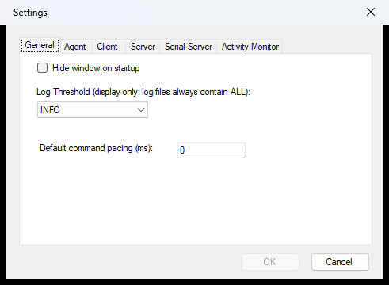

<!--
// Copyright © Kindel, LLC - http://www.kindel.com
// Published under the MIT License - Source on GitHub: https://github.com/tig/mcec
-->

# Configuration

Everything MCEC does is configured in one of three places: the **File ▸ Settings…** dialog, the
`mcec.settings` file it writes, and the `mcec.commands` command table. This chapter covers all of them:
running MCEC, every Settings tab, the agent gates in `mcec.settings`, enabling commands, and logging.

For **installing** MCEC and where its files live, see [Install](install.md); for the **security model**
behind the agent gates, see [Agent Safety](safety-emergency-stop-and-provisioning.md); for the agent
tools themselves, see [Environment Controller](environment-controller.md).

Installed under Program Files, MCEC keeps its configuration under `%APPDATA%\Kindel\MCEC`
(`mcec.settings`, `mcec.commands`, `mcec.log`); a copy run from anywhere else reads its config co-located
in its own folder (see [Install](install.md#side-by-side-copies)).

## Running

Setup installs MCEC under Program Files and adds it to the **Start Menu**; after installation, launch it
from there. MCEC runs as a normal windowed app that can minimize to a taskbar (tray) icon. Closing the
main window minimizes it to the tray; double-click the tray icon to show it again, or right-click for a
menu. To start hidden, check **Hide Window at Startup** in **Settings**.

To run headless as an **MCP server** (no main window, no tray icon; the command overlay and the
emergency-stop hotkey still work), launch it with `mcp` (or the equivalent `--mcp`); an MCP client can
spawn it on demand and talk JSON-RPC over stdio:

```
mcec.exe mcp
```

The **installed** copy (under Program Files) never serves the full agent surface: it refuses to start
the MCP/HTTP endpoint, and over `mcp`/`--mcp` it serves only the provisioning **bootstrap**
(`provision-session` / `end-session`), because enabling agent gates in the installed configuration would
leak them enabled if a session crashed. Use [session provisioning](safety-emergency-stop-and-provisioning.md)
to get a disposable, isolated copy that serves everything — call `provision-session` (or click
**Provision new…** on File ▸ Settings ▸ Agent), or copy the install directory somewhere writable and run
from there.

`mcec.exe` also has a command-line surface (built on
[Terminal.Gui.Cli](https://github.com/gui-cs/cli)): `--help`, `--version`, `--opencli` (machine-readable
command metadata for tools and agents), and `agent-guide` (prints the same agent guidance the MCP server
hands connecting clients). Run these from a terminal; with no arguments `mcec.exe` starts the GUI as
always.

You can run [side-by-side copies](install.md#side-by-side-copies) by copying the install directory
somewhere writable; each copy gets its own independent `.settings`, `.commands`, and `.log`. Use
**File ▸ Exit** to shut down.

## Settings

<!-- To regenerate the settings_*.png tab screenshots below, see dialog-screenshots.md. -->


Settings are stored as XML in `mcec.settings`, in the `%APPDATA%\Kindel\MCEC` directory. Most settings
are edited from the **File ▸ Settings…** dialog; the agent gates (except the provisioning opt-in on the
**Agent** tab, below) are edited directly in `mcec.settings`.

The **General** tab:

* **Hide Window at Startup**: start minimized to the tray icon.
* **Log Threshold**: how much is shown in the main window (`INFO`, `DEBUG`, or `ALL`). Log *files* always
  contain `ALL` events.
* **Default command pacing (ms)**: delay MCEC applies before executing each received command (default 0).

The **Client**, **Server**, **Serial Server**, and **Activity Monitor** tabs configure the classic
remote-control transports and are documented in
**[Home Automation & Remote Control](home-automation.md)**.

The **Agent** tab is where you let an agent (a desktop assistant or computer-use tool) work with MCEC via
[session provisioning](safety-emergency-stop-and-provisioning.md):


* **Allow agents to provision disposable instances**: the one switch to turn on. A connected agent then
  gets a fresh, throwaway copy of MCEC to drive, deleted when it finishes. It never opens up this installed
  copy.
* **Provision new…**: creates a throwaway copy yourself and shows a two-step handoff: the MCP client
  setup line, and a ready-made briefing prompt to paste to your agent (its session id, token, rules of
  engagement, and teardown duty), each with its own copy button.
* **Provisioned instances**: lists those copies (age, size, running or not), with **Delete** / **Delete
  all** to clear any an agent left behind. MCEC also cleans up stale ones on its own.

While an agent is driving, it may ask to use a command that is disabled (for example `launch`). MCEC then
shows you a consent dialog naming the command(s) and the agent's stated reason; you can allow just those,
allow those plus any later requests, or deny (the default; a deny is final for that instance). Grants are
in-memory and die with the instance; nothing is written to your config files. See
**[Agent Safety](safety-emergency-stop-and-provisioning.md)**.

### Agent settings (in `mcec.settings`)

The agent surface is configured by these keys. All are off/safe by default; see
**[Agent Safety](safety-emergency-stop-and-provisioning.md)** for the full security model.

| Setting | Default | Meaning |
|---------|---------|---------|
| `AgentCommandsEnabled` | `false` | Master opt-in for the agent observation/actuation commands. Separate from the classic command enable. |
| `McpServerEnabled` | `false` | Enables the localhost HTTP/JSON-RPC floor (`POST /mcp`). |
| `McpBindAddress` | `127.0.0.1` | Address the HTTP floor binds to (localhost only by default). |
| `McpHttpPort` | `5151` | Port for the HTTP floor. |
| `CommandOverlayEnabled` | `true` | Shows an on-screen overlay narrating each agent command as it runs, so anyone watching can see MCEC is driving. |
| `CommandOverlayPosition` | `Right` | Which side of the primary screen the overlay docks to. |
| `EmergencyStopEnabled` | `true` | Arms the global emergency-stop hotkey while the agent front door could be driving. |
| `EmergencyStopHotkey` | `Ctrl+Alt+Shift+S` | The panic-hotkey chord (a `+`-separated spec). |
| `AllowSessionProvisioning` | `false` | Operator opt-in that lets an agent request a fresh, isolated MCEC instance via `provision-session` (and enables the **Provision new…** button on the Agent tab). |
| `AgentRecordMaxFps` / `AgentRecordMaxDurationMs` / `AgentRecordMaxFrames` / `AgentRecordMaxWidth` | 30 / 60000 / 600 / 1280 | Safety limits for the `record` tool (requests above them are clamped, not failed). |

Restart MCEC (or relaunch `--mcp`) after editing `mcec.settings`.

## Enabling or Disabling Commands

For security, **every** command is disabled by default; this reduces the surface area MCEC exposes. This
applies to both the classic commands and the agent commands: an agent command runs only when
`AgentCommandsEnabled=true` **and** that individual command is enabled.

Use the **Commands Window** (**Commands ▸ Enable and Test Commands…**) to enable/disable commands and test
them. Details, including the `mcec.commands` XML format, are in
**[Home Automation & Remote Control](home-automation.md#enabling-or-disabling-commands)**. An agent that
needs a disabled command can also ask you for it live via `request-command-access`; you approve or deny
on-screen, and an approval enables it in-memory for that instance only (see
**[Agent Safety](safety-emergency-stop-and-provisioning.md)**).

## Agent safety

The agent gates above decide *whether* the agent surface is reachable. Three operator-safety features build
on them: the global **emergency-stop** hotkey, disposable **isolated session provisioning**, and
on-screen **command-access consent**. All are covered in
**[Agent Safety](safety-emergency-stop-and-provisioning.md)**.

## Logging

Informational, debug, and diagnostic events are logged to `mcec.log` and shown in the main window. Installs
under Program Files write the log to `%APPDATA%\Kindel\MCEC\mcec.log`. Otherwise the log is written to the
directory MCEC is started from.
Every agent action is additionally logged with a loud `AGENT-AUDIT:` line so agent activity is impossible
to miss.
