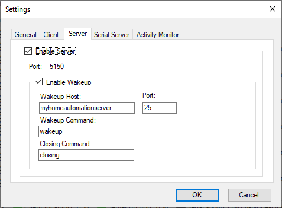
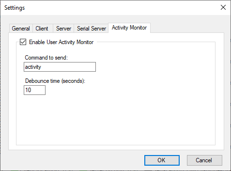
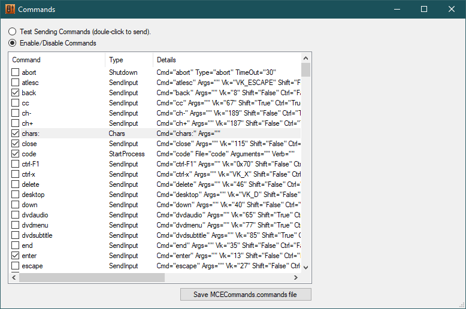
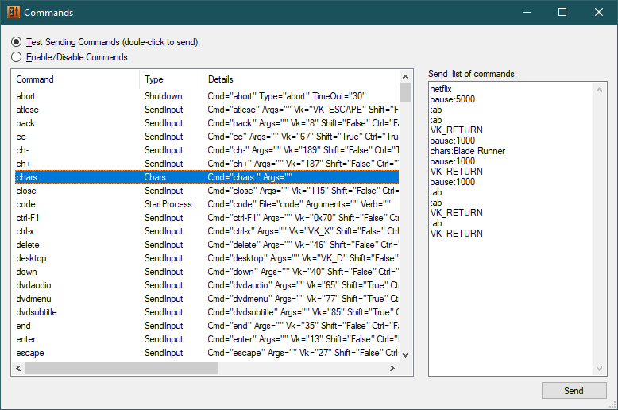

# MCE Controller Documentation

**MCE Controller** (MCEC) provides robust remote control a Windows HTPC (or any PC) over the network. It runs in the background listening on the network (or serial port) for *Commands*. It then translates those commands into actions such as keystrokes, text input, and the starting of programs. Any remote control, home control system, or application that can send text strings via TCP/IP or a serial port can use **MCEC** to control a Windows PC.

For example:

* The command `netflix` will cause the Netflix application to start.
* The command `maximize` will cause the current window to be maximized on the display. This is equivalent to choosing the "Maximize" button on the window's window menu.
* The command `chars:Hello World!` will cause the text "Hello World" to be typed, as though it were typed on the keyboard.
* The command `VK_MEDIA_NEXT_TRACK` will cause the currently running media player app (Spotify, Windows Media Player, etc...) to jump to the next media track, just as if the user had pressed th "next track" key on the keyboard.
* The commands that **MCEC** supports is extensible through a configuration file. If it does not natively support a function you wish, you can add new commands easily.

**MCEC** was initially developed to enable integration of a Windows Media Center based home theater PC (HTPC) into a Crestron whole-house audio/video system. However, it is general enough that others have used it within other control system that support sending text strings to a TCP/IP port. Most control systems, such as Crestron or AMX, support IR emitting.

**MCEC** can act as either a TCP/IP client or server. When acting as a client the target host and port can be configured. When acting as a server the incoming port can be configured.

**MCEC** can also listen on an RS-232 serial port.

**MCEC** can run showing only a taskbar icon. By double clicking on the taskbar a status window is displayed that shows a log of all activity. You can also right-click on the taskbar icon for a menu.

## Windows PC Control Capabilities

By default **MCEC** supports over 250 built-in commands for controlling a Windows PC remotely. The list below summarizes these control capabilities.

* Supports simulating key presses (e.g. Alt-Tab, or Win-S) with `SendInput` commands.
* Supports simulating the mouse with `mouse:` commands.
* Supports simulating Windows messages (e.g. `WM_SYSCOMMAND` / `SC_MAXIMIZE`) with `SendMessage`commands.
* Supports simulating start process commands (e.g. run `notepad.exe`) with the `StartProcess`command.
* Supports simulating changing the window focus with the `SetForegroundWindow` command.
* Supports sending text (e.g. simulating typing) with the `chars:` command.
* Commands can be paced (slowed down) and there's a `pause` command enabling waiting for apps to open etc...
* Includes built-in support for common Windows Media Center commands.
* It can easily be extended to suit your needs through a `MCEController.commands file.`

## Key Features

* Can act as a TCP/IP client. Specify a `host` (as a `hostname` or `IP address`) and `port` to connect to. The host can then send commands back on the TCP/IP connection for MCE Controller to act on.
* Can act as a TCP/IP server. Specify a 'port' for it to listen on and any TCP/IP client can connect and send commands. The Server supports any number of simultaneous clients. The Telnet protocol is supported.
* Can act as a Serial server listening on RS-232 COM port.
* Supports running multiple instances.
* Can start minimized as a taskbar icon. This can be changed in Settings...
* Has a built-in test mode that makes it easy to test commands.
* The **User Activity Monitor** feature will send a command to the home automation system when a user is using the PC (moving the mouse or typing).
* Automatically checks to see if newer versions are available.
* Logs diagnostics information to a file.
* Detects new version and makes it easy to install them from the **Help** menu.

## Installation

**MCEC** V2 was developed for Windows 10. It has not been tested on older versions of Windows. Submit an [Issue](https://github.com/tig/mcec/issues) to request a specific version of Windows to be supported.

To install, go here: **[Download and Install the Latest Version](https://github.com/tig/mcec/releases)**

If **Collect Telemetry** is checked during setup, usage information will be sent to a telemetry service to enable improvements. Telemetry is controlled via the `HKEY_LOCAL_MACHINE\SOFTWARE\Kindel Systems\MCE Controller [Telemetry]` registry key (`1` enables and `0` disables). See [this page](telemetry.md) for details on what telemetry is collected and how it is used.

Un-install **MCEC** via add/remove programs.

## Running

When **MCE Controller** runs, it defaults to showing itself. If you close the main MCE Controller window the app will minimize to an icon in the taskbar. Double clicking on the taskbar icon will cause the window to show itself again.

If you would like **MCEC** to automatically hide upon startup, check the _Hide Window at Startup_ checkbox in the **Settings** dialog.

To have **MCEC** start automatically do the following:

1. Create a Windows shortcut to `MCEControl.exe` (found in `C:\Program Files (x86)\Kindel Systems\MCE Controller` by default).
2. Put the shortcut file into the Windows Startup Folder (`C:\Users\[User Name]\AppData\Roaming\Microsoft\Windows\Start Menu\Programs\Startup`).

Run multiple instances of **MCEC** by simply copying the contents of the installation directory to another directory. Each copy will then have its own independent `.settings`, `.commands`, and `.log` files.

## Closing

Use the **File.Exit** menu to shut down the app.

## Settings


Configuration settings are stored in `MCEControl.settings` found in the  `%APPDATA%\Roaming\Kindel Systems\MCE Controller` directory.

All settings can be configured from **Settings** dialog box the **File.Settings...** menu. The **General** tab shown above supports the following settings:

* **Hide Window at Startup** - If checked the **MCEC** will start minimized to tray icon.
* **Log Threshold** - By default only informational log events will be shown in the MCE Controller main window. This setting over-rides this enabling the display of `INFO`, `DEBUG`, or `ALL` log settings. Note that the log files always include `ALL` events.
* **Default command pacing (ms)** - If this value is greater than 0, **MCEC** will delay executing each command it receives by the value (in milliseconds). The default is 0.

### The Client Tab

The *Client* Settings tab controls **MCE Controller’s** TCP/IP client functionality. When acting as a client, **MCEC** will repeatedly try to connect to the specified port on the specified host and wait for commands to be sent from the host. **MCEC** sends nothing to the host by default.


* **Enable Client** - This checkbox enables or disables the TCP/IP client functionality. If enabled, the followings settings apply:
* **Host** - This is the IP address or host name of the server **MCEC** will connect to.
* **Port** - This is the port that **MCEC** will connect to.
* **Reconnect Wait Time (ms)** - This is the number of milliseconds (default is 30 seconds or 30000 ms) **MCEC** will wait before trying to reconnect to the host once a connection has been dropped.

The status of the Client is displayed on the main window status bar. Double-clicking on the status will cause the Client to toggle between connected / not connected. Green means connected, red means active but not connected, and gray means the client is not active.

### The Server Tab

**MCE Controller** can act as either a TCP/IP client or server (it can actually operate as both simultaneously, which can be useful for testing, but not much else). By default MCE Controller is configured to act as a TCP/IP server listening on port 5150. You can change this behavior using the Settings dialog described below.

The *Server* Settings tab controls **MCEC’s** TCP/IP server functionality. When acting as a server, **MCEC** will open the specified port and wait for a client to connect. When a client does connect **MCEC** will wait for incoming commands until the client closes the connection.

**MCEC** supports any number of multiple-simultaneous connections to the Server.



* **Enable Server** - This checkbox enables or disables the TCP/IP server functionality. If enabled, the followings settings apply:
* **Port**- This is the port that **MCEC** will listen on.
* **Enable Wakeup** - If enabled, **MCEC** will attempt to connect to the specified host/port, send the “Wakeup command” and disconnect when it first starts. When it shuts down it will send the “Closing command”. This functionality is useful when the remote client needs to be notified that **MCEC** is ready (for example after the control system has rebooted).

The status of the Server is displayed on the main window status bar. Double-clicking on the status will cause the Server to toggle between connected / not connected. Green means one or more clients are connected, red means the Server is running but no clients are connected, and gray means the Server is not active.

### The Serial Server Tab

The *Serial Server* Settings controls **MCE Controller’s** serial port (RS-232) functionality. When the Serial Server is enabled, **MCEC** will open the specified COM port (e.g. COM1) and wait commands to be sent.


* **Enable Serial Server** - This checkbox enables or disables the Serial Server functionality. It is disabled by default. If enabled, the followings settings apply:
* **Port** - This is the serial port that **MCEC** will listen on (e.g. COM1).
* **Baud Rate** - Sets the speed of the serial port.
* **Data Bits**, `Parity`, `Stop Bits`, and `Handshake`: Set the serial port configuration.

The status of the Serial Server is displayed on the main window status bar. Double-clicking on the status will cause the Serial Server to toggle between connected / not connected. Green means connected, red means not connected, and gray means the Serial Server is not active.

### The Activity Monitor Tab

**MCE Controller**'s **User Activity Monitor** sends a command (`activity` by default) to the home automation system when a user is using the PC. It knows the user is using the PC monitoring keyboard and mouse movement. If the mouse is moving or keys are being pressed, the PC is in use. This is useful for adding additional context to a room occupancy sensor in a home automation system.



* **Enable User Activity Monitor** - This checkbox enables or disables the Activity Monitor. It is disabled by default. If enabled, the followings settings apply:
* **Command to send** - The string that will be sent when user activity is detected. `activity` is default.
* **Debounce time (seconds)** - The activity message will be sent no more frequently than **Debounce time** seconds.

See [Control4 User Activity Driver](https://github.com/tig/User_Activity) for an example Control4 driver that utilizes this functionality.

## Enabling or Disabling Commands

By default ALL commands are disabled to reduce the surface area *MCEC* exposes on the network. Use the **Commands Window** to enable/disable commands.



Clicking the **Save MCECommmands.commands. file** button will immediately save changes. Note the `.commands` file will be saved automatically whenever *MCEC* exits.

## Testing MCE Controller

The built-in TCP/IP client can send commands to another instance of **MCE Controller** running on the same or different PC. Or, if both the Client and Server in a single instance are set to connect to `localhost` and the same port they can connect to each other, enabling easy testing of commands.

By default **MCEC** is configured such the following will configure "test mode".

1. Open the Settings dialog from the **File.Settings...** menu.
2. Click on the Client tab and check the **Act as Client** check-box.
3. Enter `localhost` in the **Host** edit box.
4. Click on the Server tab and check the **Act as Server** check-box
5. Hit **Ok**
6. Click on the **Commands.Enable and Test Commands...** menu and start testing commands.



The **Commands Window** shows a list of all *Commands* **MCE Controller** is configured to 'listen for'. It is useful to see the full list and to be able to test them.

* Double click on any command to cause it to be sent from the Client to the Server (be careful, because if you double click on 'shutdown' your PC will literally shut down!).
* Type anything into the **Send "chars:" command** edit box and press **Send** to send a `chars:` command.
* Type a command (or list of *Commands*, one per line) into the **Send any command** edit box and press **Send** to send those commands.

The example in the screenshot above will start the movie Blade Runner playing on Netflix (if the Netflix app is installed from the Windows Store).

Try this as a quick test (the 2nd line is a space (` `)):

    shiftdown:lwin
    x
    shiftup:lwin

This will cause the Windows Quick Link Menu to pop up just like a user typed `Win-X`.

Turn on the **Activity Monitor** while in test mode and you'll see events in the log for when activity is detected.

### Using PUTTY

PuTTY is a free terminal emulator (and Telnet and SSH client). It works well for testing **MCE Controller**. You can download [PuTTY here](http://www.chiark.greenend.org.uk/~sgtatham/putty/).

#### Using PUTTY to test TCP/IP interactions

1. Run PUTTY.EXE
2. Set **Host Name** to `localhost` (or the network name of the PC running MCE Controller
3. Set **Port** to the port MCE Controller is set to listen on (e.g. 5150)
4. Set the **Connection Type** to **Raw**.
5. Click **Open**

Type commands in the PuTTY Window and see how MCE Controller reacts.

#### Using PUTTY to test serial connections

PuTTY supports connecting via serial ports. The usage is the same as in the TCP/IP example above except you set the appropriate COM port settings in PuTTY and choose the **Serial** destination type.

## Commands Details

**MCE Controller** works with ***Commands***. *Commands* are text strings like `greenbutton`, `hibernate`, and `winkey` tha **MCEC** listens to and acts on. Each command has a **Type**. When **MCEC** receives a command it causes an action to happen on the PC it is running on. The action taken is dependent on the type of command and the parameters set for that command.

*IMPORTANT*: As of version 2.2.1, ALL commands are disabled by default to reduce the surface area *MCEC* exposes on the network. Use the **Commands Window** to enable/disable commands.

### Types
The following command types are supported by **MCE Controller**:

* **`StartProcess`** - Starts the specified process. Can specify the path to an executable, shortcut, or a URI. Supports embedded `nextCommand` elements allowing other form of MCE Controller commands to be invoke after the process starts.
* **`SetForgroundWindow`** - Causes the specified window to be brought to the foreground.
* **`Shutdown`** - Allows the host computer to be shutdown, restarted, put in standby, or hibernate mode.
* **`SendMessage`** - Enables the sending of window messages to windows. E.g. the 'mcemaximize' command causes the Media Center window to go full screen.
* **`SendInput`** - Sends keyboard input as though it were typed on a keyboard.
* **`Chars`** - Sends text.
* **`Mouse`** - Sends mouse movement and button actions.
* **`Pause`** - Pauses after a command before another is exectued (in milliseconds).
* **Built-In** - Single characters, `VK_` codes, `chars:`, `shiftdown:`, `shiftup:`, `pause:`, and `mcec:.`

### Built-in Commands

**MCE Controller** includes a set of pre-defined commands for controlling a Windows PC as well as standard keyboard input. Pre-defined commands can be viewed in the **Commands Window**. See the section titled “Defining Your Own Commands” below for instructions on how to add or change the commands **MCEC** supports.

**MCEC** commands (`Cmd` values) are _not_ case-sensitive. Thus `VK_UP` is equivalent to `vk_up` and `shutdown` is equivalent to `ShutDown`.

The following describes the Built-In commands:

#### Commands for Simulating Keyboard Input

Any Windows virtual key code is supported by default. The form of the commands are `VK_<key name>`. For example you can send **MCE Controller** any of the following commands and the corresponding key press will be simulated.

```
VK_ESCAPE
VK_LWIN
VK_VOLUME_MUTE
VK_VOLUME_UP
VK_MEDIA_PLAY_PAUSE
VK_F1
```

A list of all Window's virtual key codes can be found here: [this MSDN page](http://msdn.microsoft.com/en-us/library/dd375731.aspx)

Anytime **MCE Controller** receives `chars:` plus some text, it simulates the typing of that text on the keyboard. The syntax of the command is `chars:*` where '*'' represents one or more characters. This is equivalent to typing those characters on the keyboard. E.g. `chars:3` will cause the number 3 to be typed as though the user had pressed the 3 key on the keyboard. `chars:Hello` will be just like the user pressed the following keys:

```
Shift key down
h
Shift key up
e
l
l
o
```

The string that follows `chars:` can include *character escapes*. This enables sending unprintable characters. E.g. `chars:\\` sends `\` and `chars:\u263A` sends `☺` and `chars:\f` sends a form feed character. The set of character escapes supported is documented [here](https://docs.microsoft.com/en-us/dotnet/standard/base-types/character-escapes-in-regular-expressions).

Note, how `chars:` behaves relative to the state of `shift`, `alt`, `ctrl`, and `win` keys is dependent on which modifier key is used and the application that is in the foreground. Specifically, `shift` is ignored and for the other modifier keys, the behavior is app dependent. Using `<SendInput/>` commands is recommended for fine-grain control of behavior that depends on modifier keys. See [Issue #14](https://github.com/tig/mcec/issues/14) for more details.

Sending a single character without the `chars:` command (e.g. just `c`) is equivalent to a `SendInput` command defined as `<SendInput Cmd="cmdname" Vk="c" />` (see below). In other words, sending a single character is the same as a single key press of a key on the keyboard. For example sending `a` will result in the A key being pressed. `1` will result in the `1` key being pressed. There is no difference between sending `a` and `A`. Use `shiftdown:/shiftup:` to simulate the pressing of the shift, control, alt, and windows keys.

Unicode (and other escaped character sequences are supported). `chars:\u20AC` will cause the € character to be input into the foreground window on the machine **MCEC** is running on.

Note: the `chars:` command must be enabled for single character commands to work.

#### Simulating Shift, Control, Alt, and the Windows keys

To simulate a key down event for one of the modifiers keys (shift, control, alt, and the Windows key) send a `shiftdown:` or `shiftup:` command. The syntax is:

    shiftdown:[shift|ctrl|alt|lwin|rwin]

and

    shiftup:[shift|ctrl|alt|lwin|rwin]

For example, to simulate the typing of 'Test!' send the following lines:

    shiftdown:shift
    t
    shiftup:shift
    e
    s
    t
    shiftdown:shift
    1
    shiftup:shift

This would do the same thing as if `chars:Test!` were sent.

This scheme can be used as an alternative way of sending ctrl-, alt-, and win- keystrokes. For example to simulate ctrl-s:

    shiftdown:ctrl
    s
    shiftup:ctrl

#### Mouse Commands

With `Mouse` commands it is possible to build a remote control that acts like a mouse (I built a test app for Windows Phone 7 that enables WP7 to work like a touchpad; contact me if you are interested in it).

The general format of the mouse commands is:

    mouse:<action>[,<param>,...,<param>]

The available mouse actions are:

* **`lbc`** - Left button click (`mouse:lbc`)
* **`lbdc`** - Left button double-click (`mouse:lbdc`)
* **`lbd`** - Left button down (`mouse:lbd`)
* **`lbu`** - Left button up (`mouse:lbu`)
* **`rbc`, `rbdc`, `rbd`, `rbu`** - Same same but for the right mouse button.
* **`mbc`, `mbdc`, `mbd`, `mbu`** - Same same but for the middle mouse button.
* **`xbc`, etc...** - x button click where x is a button number (`mouse:xbc,3` for XButton 3 click...whatever that is)
* **`mm,x,y`** - Move the mouse x, y pixels (`mouse:mm,7,-3` would move the mouse right 7 and up 3 pixels)
* **`mt,x,y`** - Move the mouse to a location. The coordinates represent the absolute X/Y-coordinates on the primary display device where 0 is the extreme left/bottom of the display device and 65535 is the extreme right/bottom hand side of the display device (`mouse:mt,0,65535` would move the mouse to the bottom left corner of the primary display).
* **`mtv,x,y`** - Move the mouse to a location on the virtual desktop. The coordinates represent the absolute X/Y-coordinates on the virtual desktop where 0 is the extreme left/top of the virtual desktop and 65535 is the extreme right/bottom (`mouse:mtv,65535,0` would move the mouse to the top right corner of the virtual desktop).
* **`hs,n`** - Simlate a horizontal scroll gesture. `n` is the amount to scroll in clicks. A positive value indicates that the wheel was rotated to the right; a negative value indicates that the wheel was rotated to the left (`mouse:hs,3`).
* **`vs,n`** - Simlate a vertical scroll gesture. `n` is the amount to scroll in clicks. A positive value indicates that the wheel was rotated forward, away from the user; a negative value indicates that the wheel was rotated backward, toward the user (`mouse:vs,3`).

When sending mouse movements it is best if the **MCEC** window is hidden as the display log tends to chew up a lot of resources, making things jerky.

#### mcec: Commands

The following commands control **MCE Controller** itself:

* **`mcec:ver`** – Gets the version number.
* **`mcec:exit`** – Causes **MCEC** to exit.
* **`mcec:cmds`** – Lists all commands.

Values returned by commands in **MCEC** are of the format `command=value` where command is the command to the left of the command prefix (`mcec:`).

### Defining Your Own Commands

**MCE Controller** provides almost 300 built-in commands. The first time MCE Controller runs, it creates an `MCEControl.commands` file including all built-in commands (with `Enabled="false"` set on ALL of them). After running MCEController once, you can You can override or augment this set by editing the `MCEControl.commands` file and (Use the **Commands.Open commands folder...** menu to find the file location on your machine.

Note deleting a built-in command from the `.commands` file will not remove it permanently. Anytime **MCEC* saves the file built-in commands will be re-added; however, `Enabled="false"` will be set which is functionally equivalent to deleting them.

Some of the built-in commands are obviously just examples.

[See more examples here.](example_commands.md)

#### File Format

The file format is XML and must include the headers. `Commands` are defined within the `<commands>` element.

```xml
<?xml version="1.0"?>
<mcecontroller xmlns:xsd="http://www.w3.org/2001/XMLSchema" xmlns:xsi="http://www.w3.org/2001/XMLSchema-instance" version="2.2.1.159">
  <commands xmlns="http://www.kindel.com/products/mcecontroller">
    ...
  </commands>
</mcecontroler>
```

Whenever the `MCEControl.commands` changes, it is reloaded. You do not need to exit the program and restart it to test changes (as was the case in v1).

`MCEControl.commands` supports defining the following types of commands.

* `Chars` - Simulates text input.
* `Mcec` - MCE Controller control.
* `Pause` - Delays.
* `SendInput` - Simulates keyboard input.
* `SendMessage` - Sends Windows messages.
* `SetForegroundWindow` - Brings a Window to the foreground, enabling control.
* `Shutdown` - Commands for rebooting, suspending, and shutting down the computer.
* `StartProcess` - Start other programs.

The form of a Command definition is:

```xml
    <type Cmd="text to trigger on" Args="optioal args" etc.../>
```

**Note on case sensitivity**: All XML element and attribute names are case-insensitive. E.g. `ctrl` is the same as `Ctrl`.  The value of the `Cmd` attribute is NOT case-sensitive. E.g. `MonitorOff` will be treated the same as `monitoroff`. Some attribute values ARE case sensitive (e.g. in `<SendInput/>` commands `Ctrl="true"` will work but `Ctrl="False"` will not).

Do not make commands a single character or it will interfere with the ability to simulate individual character key presses.

#### Nesting

*Commands* support chaining by nesting elements. The nested commands will be executed after the started application starts processing windows messages.

For example, the following launches Notepad, waits 1 second and then types some text.

```xml
<StartProcess Cmd="notepad" File="notepad.exe" >
    <Pause Args="1000"/>
    <Chars Cmd="test" Args="this is a test." />
</StartProcess>
```

**Note on case sensitivity**: In the `MCEControl.commands` file, all XML element and attribute names are case-insensitive. E.g. `ctrl` IS the same as `Ctrl`. The value of the `Cmd` attribute is NOT case-sensitive (e.g. `Cmd="MonitorOff"` will be treated the same as `cmd="monitoroff"`. The values of any `true/false` attribute must be lower case `true` or `false`.

#### SendInput Commands

`SendInput` commands simulate keyboard key-presses. Any combination of shift, ctrl, alt, and left/right Windows keys can be used with any "virtual key code". See the `winuser.h` file in the Windows SDK or [this MSDN page](http://msdn.microsoft.com/en-us/library/dd375731.aspx) for a definition of all standard `VK_` codes. `SendInput` commands understand single characters (e.g. `x` or `\u0020`), key codes in hex (e.g. `0x2a`) or decimal format, or as a `VK_` name. Under the covers, the Windows `SendInput()` API is used send keystrokes. Keystrokes always go to the foreground window.

For example, the following causes a **Ctrl-P** to be sent to the foreground window, and if that window is Media Center, the My Pictures page appears:

```xml
<SendInput Cmd="mypictures" vk="73" Shift="false" Ctrl="true" Alt="false" />
<SendInput Cmd="mypictures" vk="P" Shift="false" Ctrl="true" Alt="false" />
```

This example causes a Windows-X to be simulated, which causes the Windows 10 "expert" menu to pop up:

```xml
<SendInput Cmd="winx" vk="VK_X" Win="true"/>
```

The below illustrate how single character commands (see below) are implemented. Each of these does precisely the same thing as if **MCE Controller* received a space (` `) character (assuming `chars:` command was enabled, of course):

```xml
<SendInput Cmd="space" vk="VK_SPACE" Enabled="true"/>
<SendInput Cmd="space" vk=" " Enabled="true"/>
<SendInput Cmd="space" vk="\u0020" Enabled="true"/>
<SendInput Cmd="space" vk="0x20" Enabled="true"/>
```

#### SendMessage Commands

`SendMessage` commands cause a Windows message to be sent using the `SendMessage()` API to the foreground window if no class name is specified, or to a particular window if that window’s class is specified. `Msg`, `wParam`, and `lParam` must be specified in decimal (**not hex!**).

For example, the following is equivalent to sending a `WM_SYSCOMMAND` with the `SC_MAXIMIZE` flag, causing the window with the class name of `ehshell` to be maximized (`WM_SYSCOMMAND == 247` and `SC_MAXIMIZE == 61488`):

```xml
<SendMessage Cmd="mce_maximize" ClassName="ehshell" Msg="274" wParam="61488" lParam="0" />
```

These example commands might be useful in some scenarios:

```xml
<!--      WM_SYSCOMMAND, SC_SCREENSAVE                                 -->
<SendMessage Cmd="screensaver" Msg="274" wParam="61760" lParam="0" />
<!--      WM_SYSCOMMAND, SC_MONITORPOWER, 2 = off, -1 = on             -->
<SendMessage Cmd="monitoroff" Msg="274" wParam="61808" lParam="2" />
<SendMessage Cmd="monitoron" Msg="274" wParam="61808" lParam="-1" />
```

See the [MSDN documentation](http://msdn.microsoft.com/en-us/library/ms646360(v=VS.85).aspx) for more `WM_SYSCOMMAND` possibilities.

#### StartProcess Commands

`StartProcess` commands start processes (programs). Process commands support chaining using nested command elements. For `Start Process` commands the first embedded command will be executed after the started application starts processing windows messages.

Examples:

```xml
<Startprocess cmd="code" file="code" Arguments="foo.cs" />
<StartProcess Cmd="tada" File="C:\Windows\Media\tada.wav" Verb="Open" />
<StartProcess Cmd="term" File="shell:AppsFolder\Microsoft.WindowsTerminal_8wekyb3d8bbwe!App" />
<StartProcess Cmd="netflix" File="shell:AppsFolder\4DF9E0F8.Netflix_mcm4njqhnhss8!Netflix.App" />
```

#### Shutdown Commands

The supported shutdown commands are self-explanatory.

```xml
<Shutdown Cmd="shutdown" Type="shutdown" Timeout="30"/>
<Shutdown Cmd="restart" Type="restart"/>
<Shutdown Cmd="abort" Type="abort"/>
<Shutdown Cmd="standby" Type="standby"/>
<Shutdown Cmd="hibernate" Type="hibernate"/>
```

#### SetForgroundWindow Commands

The `SetForegroundWindow` command sets the specified process's main window to the foreground.

For example, eiter of the following makes Notepad the foreground Window (assuming Notepad is running):

```xml
<SetForegroundWindow Cmd="activatenotepad" AppName="Notepad"/>
<SetForegroundWindow Cmd="activatenotepad" ClassName="Notepad"/>
```

`AppName` is the "friendly process name" of an app. This is the name shown in *Properties* dialog for items listed in the *Details* tab of *Windows Task Manager.*

**MCEC** uses the Windows `GetProcessesByName` API which returns a list of all instances of an app with the given process name. **MCE** picks the first process in the list that has a main window.

Note, the argument `ClassName` is mis-named and preserved for backwards compatibility. It is a hold-over when *MCEC* worked on older versions of Windows that enabled setting any window to the foreground. Starting with Windows Vista it is no longer possible for one app to set arbitrary windows of another app to the foreground.

#### Chars Commands

The `Chars` command  is how the `chars:` commands get processed. `<Chars Cmd="foo" Arg="bar"/>` defines `foo` such that if **MCEC** receives `foo` it will type `bar` just as it had received `chars:bar`.

#### Pause Commands

The `Pause` command delays executing the next command. `<Pause Cmd="pause3sec" Arg="3000"/>` will pause 3 seconds. This is the same as sending `pause:3000`.

Pause commands cause a delay _in addition to_ any delay introduced by the `Pacing` setting in Settings.

### Disabling All Internal Commands

You can force **MCE Controller** to only listen to and act on commands defined in the MCEControl.commands file. To do this use the Windows registry editor to create the `HKEY_LOCAL_MACHINE\SOFTWARE\Kindel Systems\MCE Controller` registry key and set `DisableInternalCommands` (a DWORD value) to anything other than 0.

This will disable ALL internal commands.

This is a machine wide setting and will apply to all instances of MCE Controller.

## Logging

Informational, debug, and diagnostic events are logged to `MCEControl.log` while MCE Controller is operating. These are also shown in the main window . If the program is started from the default location (in Program Files) the log will be written to `%LocalAppData%\Kindel Systems\MCE Controller\MCEControl.log`. Otherwise the log will be written to the directory the program is started from.

## Usage Notes

The `mcestart` command will launch Media Center and cause it to be maximized. If you do not want this behavior, change `MCEControl.commands` such that the `mcestart` command does not have the embedded `nextCommand` element.

For **MCE Controller** to work property the target application (Media Center) must be the active window (foreground) on the desktop. You can use the `mceactivate` command to cause Media Center to be the foreground app if it’s already running. Alternatively you can just use `mcestart` as it will end up causing the same thing to happen (although not as quickly).

Also, you may find that `greenbutton` is a better function than `mcestart` because it is equivalent to the green-button on a Windows remote control. `mcestart` is a bit different because if Media Center is already running `mcestart` will not go to the "Start" screen of Media Center while `greenbutton` will. However, `greenbutton` does not cause the Media Center window to be maximized.
