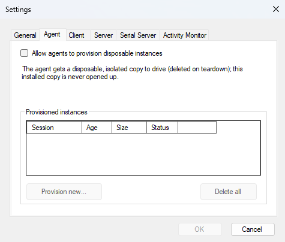

<!--
// Copyright © Kindel, LLC - http://www.kindel.com
// Published under the MIT License - Source on GitHub: https://github.com/tig/mcec
-->

# Environment Controller

MCEC 3.0 turns the MCE Controller daemon into a small, opt-in automation server for
AI agents and scripts running on a Windows PC. It gives an agent three things:

- **Eyes**: capture a screenshot of a window (or the foreground window) as a PNG.
- **Hands**: invoke any existing MCEC command (the actuation layer you already use).
- **A front door**: query/find windows and UI elements, wait for conditions, and
  drive all of the above over **MCP** (Model Context Protocol) or a tiny **HTTP** floor.

The agent surface is a set of new commands (`capture`, `query`, `displays`, `windows`, `find`,
`wait-for`, `invoke`, `record`, `launch`, `drag`, and `click`) exposed as **tools over MCP/HTTP**
so an agent can call them directly. Each tool call returns a **structured JSON result
envelope** (`{ ok, result, … }`) instead of free text, so an agent can reason about
success and failure uniformly.

> **This release is purely additive.** No existing HTPC command, transport, or default
> is changed. If you do nothing, MCEC behaves exactly as it did before; every new
> capability is **off by default** and must be explicitly enabled.

---

## SECURITY: read this first

**Enabling the agent surface lets an agent act with your rights.** MCEC drives the desktop with
**real user input**, and there is no OS sandbox around what an enabled command may touch: within its
capability, an enabled command acts as you on whatever it targets (`invoke`/`click` can operate any
control, `launch` can start any program, `capture` can read any window). What the gates below control is
the **capability surface**, not a per-target sandbox. The agent surface is off until you opt in, and every
command ships individually disabled, so you choose exactly which commands an agent may run; you can, for
example, allow read-only observation (`query`/`capture`) with no actuation at all. Every action is
audit-logged, and the operator can halt the session instantly with the emergency-stop hotkey (see
**[Agent Safety](safety-emergency-stop-and-provisioning.md)**). The safest posture is a disposable
[provisioned session](safety-emergency-stop-and-provisioning.md) rather than opening up your installed
instance; enable the agent surface only where you accept an agent acting as you on whatever the enabled
commands can reach.

With that understood: the agent server is locked down by default and uses **layered,
independent opt-ins**. Turning one thing on does **not** turn the others on.

1. **Agent commands are DISABLED by default.**
   The new observation/automation commands require their **own** opt-in,
   `AgentCommandsEnabled`, in `mcec.settings`. This is a **separate** switch from
   the existing actuation/command enable; enabling MCEC to run commands does **not**
   enable the agent surface, and vice-versa. Every individual command also remains
   `Enabled=false` until you turn it on, exactly as with all other MCEC commands.

2. **The MCP / HTTP façade is DISABLED by default.**
   The network-facing server (`McpServerEnabled`) is off unless you opt in. Even when
   enabled, the HTTP floor **binds to localhost by default**, and a **loopback** bind is
   the only configuration that needs no authentication. A loopback `McpBindAddress`
   (`localhost`, or a literal loopback IP; any `127.x.y.z`, `::1` / `[::1]`) is
   **canonicalized** before it reaches the listener; so obfuscated loopback
   spellings the OS parser still reads as loopback (e.g. `127.1`, `0x7f.0.0.1`,
   `2130706433`, `::ffff:127.0.0.1`) are normalized to a plain loopback literal
   (`127.0.0.1` / `[::1]`) rather than passed through raw, closing a path where the
   underlying HTTP stack could treat the raw form as a wildcard binding. A **non-loopback**
   bind (a specific LAN IP, or the all-interfaces `0.0.0.0` / `::`) is a deliberate
   off-box exposure and is allowed **only when `McpAuthToken` is set**; without a
   token MCEC **refuses to start the HTTP listener**, logging a loud error, so a config
   typo can never silently expose unauthenticated UI automation to the network. (The
   `HttpListener` wildcards `+` / `*` and other hostnames are not loopback and are never
   DNS-resolved, so they too require a token; and generally fail to bind.)

3. **Every agent action is loudly audited: on screen and in the log.**
   The **on-screen command overlay is ON by default** (`CommandOverlayEnabled`, docked per
   `CommandOverlayPosition`): it narrates each command as it executes, so anyone looking at
   the screen can see that MCEC is driving the machine. In addition, each agent command
   logs an `AGENT-AUDIT:` line (action + target) before it runs; intentionally noisy so
   agent activity is impossible to miss in the MCEC log window or log files. If you see
   the overlay narrating or `AGENT-AUDIT:` lines you did not expect, something is driving
   your machine; hit the [emergency stop](safety-emergency-stop-and-provisioning.md)
   (default `Ctrl+Alt+Shift+S`).

If any one of these switches is off, the corresponding capability simply refuses to run
and returns a JSON failure (for commands); it never silently proceeds.

**Which gate applies where.** The agent *tools* (`capture`/`query`/`displays`/`windows`/`find`/`wait-for`/`invoke`/
`record`/`launch`/`drag`/`click`) are gated by **both** `AgentCommandsEnabled` **and** the per-command `Enabled`
flag, over **both** MCP transports (`mcec.exe --mcp` stdio and the HTTP floor): a `tools/call` for a
command whose `Enabled=false` is refused (`error.code: command-disabled`) even when
`AgentCommandsEnabled=true`.

**`send_command` is transport-sensitive.** It is a raw pass-through to the existing command engine,
so it is a command-injection surface. Over the **local stdio** transport (`mcec.exe --mcp`, launched by its
client; no network/CSRF surface) it keeps the documented pass-through and does **not** require
`AgentCommandsEnabled`. Over the **network-facing HTTP floor** it honors the **same `AgentCommandsEnabled`
gate as every other tool**: with `McpServerEnabled=true` but `AgentCommandsEnabled=false`, a `send_command`
`tools/call` is refused (`error.code: agent-commands-disabled`) and never executed. This is deliberate
secure-by-default hardening; enabling the HTTP floor alone must not expose a raw-command surface with no
agent opt-in. Before the front-door validation landed, such a request was reachable by browser CSRF /
DNS-rebinding; with the `Host`/`Origin`/token gate now in place **and** this `AgentCommandsEnabled` gate,
that surface is closed. In **both** cases the raw command it runs is still subject to that command's own `Enabled`
flag in `mcec.commands` (the normal MCEC gate). `McpServerEnabled` gates only the HTTP floor; it has no
bearing on stdio or on which individual tools may run.


**The command queue is bounded.** Commands (from any client: network, serial, or an agent's
`send_command`) are queued and executed paced (`CommandPacing` delay between items). To prevent a remote
memory/CPU DoS the queue is capped at **200** pending commands, and a single command's whole tree (the
command itself plus all recursively embedded commands) at **50**. Enqueue is **all-or-nothing**: a command
that breaks either bound, or whose tree doesn't fit in the queue's remaining capacity, is **dropped whole
and logged** (a `CommandInvoker` warning in the MCEC log); never partially enqueued, since a split tree
could separate paired input commands (e.g. `shiftdown:`/`shiftup:`) and leave a modifier key latched.
Agents should batch or pace long input sequences (e.g. prefer `drag`/`mouse:drag` over long `mouse:mt`
streams) rather than flooding the queue.

---

## How to enable

Edit `mcec.settings` (in your MCEC settings directory) and set the opt-ins you
want. At minimum, to use the agent commands at all:

```xml
<AgentCommandsEnabled>true</AgentCommandsEnabled>
```

To additionally expose the MCP / HTTP server so agents can connect over a transport:

```xml
<McpServerEnabled>true</McpServerEnabled>
<!-- Optional; these are the defaults: -->
<McpBindAddress>127.0.0.1</McpBindAddress>
<McpHttpPort>5151</McpHttpPort>
```

Restart MCEC after editing the settings file. Remember you must **also** enable the
individual agent commands you intend to use (they ship `Enabled=false` like every other
command).

The recommended path, though, is to leave these gates off and instead tick **Allow agents to provision
disposable instances** on the Settings dialog's **Agent** tab. The agent then drives a fresh throwaway
copy (deleted when done) rather than this installed one, and the same tab cleans up any it leaves behind.
See [session provisioning](safety-emergency-stop-and-provisioning.md).



---

## The commands

All commands target a window the same way; by `window` (title substring,
case-insensitive), `handle` (HWND), `process` (process name without `.exe`),
`className`, or `foreground` (the current foreground window).

| Command    | What it does                                                                      | Key args |
|------------|-----------------------------------------------------------------------------------|----------|
| `capture`  | Screenshot a window (`PrintWindow` + `PW_RENDERFULLCONTENT`, captures WinUI/WPF surfaces) or a screen region, returned as base64 PNG. Blank/black frames are detected and flagged (see [Observation hardening](#observation-hardening--known-limitations)). | window target, or region `x`/`y`/`width`/`height`; optional `file` |
| `query`    | Dump the **UI Automation tree** of a window: control type, name, automation id, bounds, enabled/offscreen state, value. | window target, `maxDepth` (default 6), `maxNodes` (default 1000) |
| `displays` | Report **display geometry**; every monitor's pixel `bounds`, `workingArea`, `primary` flag, and `dpi`/`scale`, plus the union `virtualBounds`. Lets an agent interpret the absolute-pixel bounds `query`/`find` return and place pixel clicks/drags without measuring the screen itself. | *(none)* |
| `windows`  | **Discover top-level windows**: list each window's `handle`, `title`, `className`, `processName`, `processId`, and `bounds`, so an agent can find and target a window instead of guessing. Optionally filtered; with a `timeout` it **waits** (polls) for a matching window to appear. No filter lists all; a `timeout` with no filter is refused (won't wait for an arbitrary window). | `window`/`process`/`className` filters (all optional), `timeout` (ms; wait for a match) |
| `find`     | Find a **UI Automation element** by name / automation id / class.                 | window target, `by` (`name`\|`automationid`\|`classname`), `value`, `timeout` |
| `wait-for` | Same as `find`, but waits up to a timeout for the element to appear (default 5 s). | window target, `by`, `value`, `timeout` |
| `invoke`   | Drive a UI Automation element pattern (incl. select for SelectionItem); far more reliable than coordinate clicks. | window target, `by`, `value`, `action` (`invoke`\|`toggle`\|`setvalue`\|`setfocus`\|`expand`\|`collapse`\|`select`), `text` |
| `drag`     | Press → move along a path → release, dispatched **atomically** (nothing interleaves). Each endpoint is a UI Automation element (dragged from/to its centre) or an absolute screen pixel; add `path` waypoints for a curved/multi-stop drag. Covers window resize/move by chrome, sliders, marquee-select, drag-reorder. | window target (needed when an endpoint is an element); `from`/`to` each `{ by, value }` or `{ x, y }`; optional `path` `[{ x, y }, …]` |
| `launch`   | Launch an app directly (path + args + working dir); gated. Returns pid and primary window handle/info when the window appears. Preferred over Win+R composition. | `path` (required), `arguments`, `workingDirectory`, `timeout` |
| `click`    | Click at a point (a UI Automation element's centre or an absolute screen pixel); move+click is dispatched **atomically**. For element types `invoke` can't drive, or when you must target a pixel. Prefer `invoke` for ordinary buttons/menus. | window target (needed when `at` is an element); `at` = `{ by, value }` or `{ x, y }`; `button` (`left`\|`right`\|`middle`, default `left`); `count` (`1`\|`2`, default `1`) |
| `record`   | Record a window or region to an **animated GIF** over time (start/stop or a bounded one-shot). | window target, or region `x`/`y`/`width`/`height`; `action` (`start`\|`stop`\|`oneshot`), `fps`, `durationMs`, `maxWidth`, `file` |

Every MCP **tool call** returns one result envelope. An agent branches on `ok` first; on
success it reads `result`, on failure it reads `error`:

```json
{
  "ok": true,
  "result": { /* tool-specific payload */ },
  "warnings": [ { "code": "tree-truncated", "detail": "…" } ],
  "sessionId": "5f19c9c01a3f"
}
```

A result is **either** a success (`ok: true`, `result` present, no `error`) **or** a failure
(`ok: false`, `error` present, no `result`); never both. `warnings` (non-fatal conditions)
may appear on either. `sessionId` names the [session](#agent-sessions) the call ran in (the
implicit default session unless the call routed itself with a `sessionId` argument).
Over MCP, the transport's `isError` flag mirrors the envelope (`isError = !ok`).

On failure the `error` object carries a stable, fine-grained `code`, a coarse `category` from
the closed taxonomy (`timeout`, `ambiguous-selector`, `stale-element`, `no-target`,
`invalid-argument`, `capture-blank`, `focus`, `elevation`, `foreground`, `internal`; `focus`
and `foreground` are reserved for future detection and are not currently produced), a
human-readable `detail`, and (when available) a `lastObservation` (the last good state before
the failure, so a failed call is debuggable without rerunning it) and a `partialResult` (the
failing call's own partial payload, e.g. a blank capture's suspect PNG):

```json
{
  "ok": false,
  "error": {
    "code": "window-not-found",
    "category": "no-target",
    "detail": "No matching window for selector window='Settings'.",
    "lastObservation": { /* the last good query/capture */ }
  },
  "sessionId": "5f19c9c01a3f"
}
```

> **Where the shape comes from.** Internally each agent command returns a structured
> `CommandResult` **object** (`src/Commands/CommandResult.cs`) carrying `success`/`data` plus the
> mandatory `errorCode`/`errorCategory` taxonomy on failure. The `AgentServer` builds the
> `{ ok, result, error, … }` envelope from that object at the MCP boundary
> (`AgentToolResult.FromCommandResult`); no serialize/re-parse round-trip and no free-text
> "categorization"; which is the shape an MCP client actually receives and the one specified by
> the shared result contract in
> [`docs/design/agent-tool-result-contract.md`](design/agent-tool-result-contract.md). A
> couple of feature-specific refusals ride in `error.code` while `error.category` stays `internal`:
> `emergency-stopped` (the operator engaged the [emergency stop](safety-emergency-stop-and-provisioning.md)),
> `provisioning-not-authorized` (`AllowSessionProvisioning` is off), and `command-disabled` (the
> per-command `Enabled` gate).

### Agent sessions

Every result carries a `sessionId`; the **session** it ran in. A session is the server's
memory of one task: its active target window, last observation, last action, last error, and a
per-session artifact directory (where a `capture`'s bytes are spilled so a later
`error.lastObservation` never re-embeds megabytes of screenshot). This lets a multi-step task be
one durable, debuggable record instead of a string of stateless calls.

For a single linear task you never touch sessions: omit `sessionId` and every call shares one
**implicit default session**, so state simply accumulates (and stdio "just works" with one ambient
session). To run **independent** tasks that must not share a target or history, use the lifecycle
tools:

- **`session-start`** creates a fresh session and returns its `sessionId` (plus its initial
  status). Echo that `sessionId` on later tool calls; each such call runs in that session and is
  echoed back on the result.
- **`session-status`** returns a session's remembered state (active target, last
  observation/action/error, artifact dir, any emergency stop). Pass `sessionId` to inspect a
  specific session, or omit it for the default.
- **`session-end`** frees a session's server-side state. It is idempotent (ending an unknown or
  already-ended id reports `ended: false` rather than erroring). Afterward a tool call that still
  echoes that id is refused with `error.code: unknown-session` (category `invalid-argument`); start
  a new one or omit `sessionId` to fall back to the default.

> **Identity is carried in-band, not bound to the connection.** Both stdio and the HTTP floor
> funnel into one stateless dispatch; the store is keyed by id, not by socket, so the same
> `sessionId` addresses the same session across either transport. The lifecycle tools are part of
> the agent surface and honor the same `AgentCommandsEnabled` opt-in and emergency-stop latch as
> every other tool.
>
> **Not the same as `provision-session`.** These sessions are in-process runtime state. A
> [provisioned session](safety-emergency-stop-and-provisioning.md) is a whole disposable MCEC
> *install* on disk (`#138`); a different concept with its own `sessionId`/`token`.
>
> **Tool names are hyphenated** (`session-start`, not `session/start`) because MCP/Anthropic tool
> names must match `^[a-zA-Z0-9_-]{1,64}$`, and to match the existing `wait-for`/`end-session`
> convention.

### `capture` result example

`capture` renders the target window (using `PrintWindow`, so it works even when the
window is occluded) and returns the image inline as base64-encoded PNG plus the window
geometry:

```json
{
  "ok": true,
  "result": {
    "handle": 1576490,
    "width": 1024,
    "height": 768,
    "encoding": "png",
    "bytes": 48213,
    "base64": "iVBORw0KGgoAAAANSUhEUgAA...",
    "blankCheck": { "blank": false, "dominantFraction": 0.34, "dominantIsDark": false },
    "window": {
      "handle": 1576490,
      "title": "Untitled - Notepad",
      "className": "Notepad",
      "processName": "notepad",
      "processId": 21344,
      "x": 120, "y": 80, "width": 1024, "height": 768
    }
  }
}
```

`blankCheck` reports the blank-frame analysis (see
[Observation hardening](#observation-hardening--known-limitations)). When a **window** capture
comes back blank the result is a failure with `error.category: "capture-blank"`, so an agent
never trusts a silent bad image. A blank **region** capture is reported as a `capture-blank`
warning instead, since a user-specified region can legitimately be empty.

**Region size limits.** Region `width`/`height` are agent-controlled, so they are capped; an
unbounded region (e.g. `40000x40000` ≈ 6.4 GB of raw ARGB, before PNG encoding and base64) could
otherwise exhaust the host's memory. A region may be at most **16384 px per side** and
**64,000,000 px total** (64 MP ≈ 256 MB raw; roughly eight 4K frames). An oversized region is
**rejected before anything is allocated or captured**: the call fails with
`errorCode: "region-too-large"` (`errorCategory: "invalid-argument"`; the recovery is to
shrink the request) and a detail stating the limit,
and the rejection is `AGENT-AUDIT:`-logged. The same caps apply to `record` regions (window
targets need no cap: they are bounded by the window's own size). These limits are fixed, not
settings: they are an anti-DoS bound sized well beyond real desktop geometry, not a tuning knob.

On a successful `capture`, MCEC additionally returns the PNG as an MCP `image` content block so
the model can view it directly, alongside the JSON envelope above.

### `record`: capturing change over time

`capture` answers "what does this look like **now**". When you need to show change *over
time* (an animation for a demo or issue report, or a repro of a transient/flicker), use
`record`, which writes an **animated GIF**.

> **⚠️ Privacy:** a recording captures whatever is on screen for its *entire* duration,
> not just one instant; it is a louder disclosure than a still `capture`. Only record
> what you mean to, keep recordings short, and be aware the GIF may contain sensitive
> content (credentials, messages, other windows). Recording is off unless the operator has
> enabled the agent commands, and every start/stop/write is `AGENT-AUDIT:`-logged.

Two ways to bound a recording:

- **One-shot:** give `durationMs` (and optional `fps`); MCEC records that long, then writes
  the GIF and returns metadata in a single call.
- **Segment:** `action: "start"` begins recording and returns immediately; `action: "stop"`
  ends it, encodes, writes the file, and returns metadata. Only one recording runs at a time.

**Recording lifecycle.** An open `start` is never unbounded: the capture loop *auto-stops*
when it hits the operator's max duration or max frames (or the target vanishes mid-record).
An auto-stopped recording is **completed, not lost**:

- `action: "stop"` still returns the buffered GIF (exactly once). A second `stop` fails with
  "No recording is in progress or awaiting fetch", and fetching releases the buffered frames.
- A new recording (`start` **or** a one-shot) is allowed after an auto-stop. If the
  auto-stopped GIF was never fetched, the new recording **replaces** it: the discarded output
  is gone, and that command's result carries an `unfetched-recording-discarded` warning (for
  a one-shot, on its single final reply); also audit-logged. Fetch with `stop` promptly if
  you want the output.

Safety limits (operator-configurable in `mcec.settings`, requests above them are *clamped*,
not failed) keep an agent from producing an unbounded file:

| Setting                    | Default  | Meaning |
|----------------------------|----------|---------|
| `AgentRecordMaxFps`        | 30       | Max frames per second (`fps` default is 5). |
| `AgentRecordMaxDurationMs` | 60000    | Max recording length (60 s). |
| `AgentRecordMaxFrames`     | 600      | Hard cap on captured frames. |
| `AgentRecordMaxWidth`      | 1280     | Frames are downscaled so width fits this. |

A `record` **region** target is additionally subject to the fixed capture region size limits
(max 16384 px per side, 64,000,000 px total; see
[Region size limits](#capture-result-example)): an oversized region fails fast with
`errorCode: "region-too-large"` before any recording starts, rather than being clamped.

A finished `record` (one-shot or `stop`) returns the output path and metadata:

```json
{
  "ok": true,
  "result": {
    "file": "C:\\Users\\me\\AppData\\Local\\Temp\\mcec-rec-20260629-141503.gif",
    "frames": 73,
    "durationMs": 14600,
    "fps": 5,
    "width": 1280,
    "height": 824,
    "bytes": 1048576,
    "target": {
      "handle": 1576490, "title": "Untitled - Notepad", "className": "Notepad",
      "processName": "notepad", "processId": 21344,
      "x": 120, "y": 80, "width": 1024, "height": 768
    }
  }
}
```

`action: "start"` returns `{ "recording": true, "fps": 5, "maxDurationMs": 60000, "target": { … } }`.
If `file` is omitted, MCEC writes to a timestamped path under the system temp directory and
reports it in `file`.

No extra dependency is used: each frame is quantized + LZW-compressed to a GIF by GDI+, and
the frames are stitched into one GIF89a (Netscape loop extension + per-frame delays). See
`docs/design/gif-recording.md` for the full design.

### `query` result example

`query` returns the window descriptor plus its UI Automation tree (depth-limited):

```json
{
  "ok": true,
  "result": {
    "window": {
      "handle": 1576490, "title": "Untitled - Notepad",
      "className": "Notepad", "processName": "notepad", "processId": 21344,
      "x": 120, "y": 80, "width": 1024, "height": 768
    },
    "nodeCount": 7,
    "truncated": false,
    "tree": {
      "controlType": "Window",
      "name": "Untitled - Notepad",
      "x": 120, "y": 80, "width": 1024, "height": 768,
      "isEnabled": true,
      "isOffscreen": false,
      "children": [
        { "controlType": "Edit", "automationId": "15", "name": "Text editor",
          "x": 122, "y": 110, "width": 1020, "height": 720, "isEnabled": true }
      ]
    }
  }
}
```

---

## Observation hardening & known limitations

An agent can only act on what it can reliably see, so `capture` and `query` are built to fail
loudly rather than hand back a plausible-looking but wrong observation. This section documents
what is trustworthy and what is not.

### Blank / black frame detection

Every capture is analyzed for blank content: the frame is sampled on a bounded grid, each pixel
is quantized to 5 bits per channel, and the share held by the single most common color is
measured. A real application window is busy and scores low; a failed grab is a flat fill and
scores ~1.0. When the dominant color covers ≥ 99% of the frame it is flagged blank, and a
near-black dominant color is distinguished from a legitimately empty (e.g. white) surface.

- A **window** capture that comes back blank is a failure (`error.category: "capture-blank"`,
  `error.code: "frame-all-black"` or `"frame-uniform"`), so it is never a *silent* bad image; an
  agent branches on the failure rather than trusting the frame. The suspect PNG the command
  grabbed still rides in `error.partialResult`, so the evidence is not lost.
- A **region** capture that comes back blank is reported as a `capture-blank` **warning**, since
  a user-specified region can legitimately be empty.
- The raw numbers are in the success payload's `blankCheck` (`blank`, `dominantFraction`, `dominantIsDark`).

### `PrintWindow` and the on-screen-blit fallback

Window capture uses `PrintWindow(PW_RENDERFULLCONTENT)`, which renders DirectComposition / WinUI 3
/ WPF surfaces that a plain screen grab returns black for, and captures windows even when occluded.
Known limits:

- **Fallback is degraded.** If the driver refuses `PrintWindow`, capture falls back to an
  on-screen blit (`Graphics.CopyFromScreen`). That blit grabs whatever pixels are physically on
  screen, so it returns black for composited/occluded surfaces and cannot see a window that is
  behind another. When the fallback runs, the result carries a `capture-fallback` warning.
- **Minimized windows** have no on-screen pixels; `PrintWindow` typically yields a blank frame
  (caught by blank detection). Restore the window before capturing.
- **Cloaked windows** (e.g. background virtual-desktop or some UWP states) may not render.
- **Hardware-overlay/protected content** (some video players, DRM surfaces) renders black by
  design and cannot be captured.

### Locked sessions and UAC

- **Locked / disconnected sessions:** when the workstation is locked or the session is detached,
  the desktop cannot be rendered and captures are blank. This is detected (blank frame) but cannot
  be worked around from user space.
- **Elevation (UAC):** MCEC running at medium integrity cannot read the UIA tree of, drive, or
  reliably capture a window owned by an elevated (high-integrity) process. When UI Automation
  reports access denied for such a target, the tool fails with `error.category: elevation`
  (`code: target-elevated`) so an agent knows to stop rather than retry; run MCEC elevated only
  if you explicitly need to automate elevated apps, and understand the security trade-off.

### UIA tree size & stability

`query` is bounded on two axes so its output stays stable for agent reasoning even on pathological
trees (e.g. a virtualized list with thousands of items):

- `maxDepth` (default 6) bounds tree depth.
- `maxNodes` (default 1000) bounds the total node count. When the cap clips the walk, the result
  reports `truncated: true` and a `tree-truncated` warning rather than silently returning a partial
  tree; `nodeCount` always reports how many nodes were captured. Raise `maxNodes` or narrow the
  target (deeper `window`/`handle` selector) for a complete tree.

Individual stale or unsupported UIA nodes never abort the whole walk; they are skipped and the
rest of the tree is returned.


---

## Using MCEC as an MCP server

MCEC can run **headless** as an MCP **stdio** server (no main window, no tray icon; the
on-screen command overlay and the emergency-stop hotkey still work) so an MCP client
(such as a desktop AI assistant) can spawn it on demand and talk to it over standard
input/output:

```
mcec.exe mcp        # or the equivalent legacy spelling: mcec.exe --mcp
```

**Never point an MCP client at the installed copy.** `mcec.exe` under Program Files
refuses `mcp`/`--mcp` (and refuses to start the MCP/HTTP endpoint) with an error
explaining the alternatives: serving agents from the installed, operator-owned copy
would mean enabling agent security gates in the one configuration the operator's own
MCEC reads, where a crashed session leaks them enabled. Instead, either have an agent
call `provision-session` (see
[Agent safety](safety-emergency-stop-and-provisioning.md)) to get a disposable,
isolated copy, or copy the install directory somewhere writable and point the client
there; a non-installed copy reads its own co-located `mcec.settings`.

The exe also exposes a CLI surface (built on
[Terminal.Gui.Cli](https://github.com/gui-cs/cli)): `--opencli` emits machine-readable
command metadata, and `agent-guide` prints the same agent guidance the MCP server
hands connecting clients.

Wire it into your MCP client config (the `claude_desktop_config.json` / `mcp.json`
style used by most clients):

```json
{
  "mcpServers": {
    "mcec": {
      "command": "C:/mcec/mcec.exe",
      "args": ["mcp"]
    }
  }
}
```

(`C:/mcec` here is a writable copy of the install directory, or a provisioned session's
`directory`; the Program Files path itself would be refused, per above.)

`mcp` is a spawned server, not an interactive command: typed at a terminal it refuses
(stdin is an interactive console; the server would block on the shared console and
Ctrl+C could not stop it). To experiment by hand, pipe requests in
(`echo '{...}' | mcec mcp`). A running server stops when its client closes stdin (EOF)
or sends `send_command mcec:exit` (the reply flushes, then the process exits); a stuck
one can always be killed (`Stop-Process -Name mcec`).

> The agent commands still obey the security gates above. Running `--mcp` does **not**
> bypass `AgentCommandsEnabled` or the per-command `Enabled` flags; set those in
> `mcec.settings` first.

### Tools exposed over MCP

When connected, the server advertises these tools:

| Tool           | Maps to                                                        |
|----------------|----------------------------------------------------------------|
| `capture`      | The `capture` command (window screenshot → base64 PNG).        |
| `query`        | The `query` command (describe a window).                       |
| `displays`     | The `displays` command (per-monitor bounds + DPI/scale, virtual bounds). |
| `windows`      | The `windows` command (list/filter top-level windows for discovery; wait for one with a timeout). |
| `find`         | The `find` command (match a UI element, one-shot).             |
| `wait-for`     | The `wait-for` command (poll for a UI element until a timeout). |
| `invoke`       | The `invoke` command (run an existing MCEC command, incl. select for tabs etc). |
| `drag`         | The `drag` command (atomic press → move-path → release, element or pixel endpoints). |
| `launch`       | Direct gated app launch (returns pid + window handle).         |
| `click`        | The `click` command (atomic click at an element centre or pixel). |
| `record`       | The `record` command (window/region → animated GIF over time). |
| `send_command` | Generic raw-command passthrough; send any MCEC command line.  |
| `session-start`  | Start a new [agent session](#agent-sessions) and return its `sessionId`. |
| `session-status` | Report a session's state (active target, last observation/action/error, artifact dir). |
| `session-end`    | End an agent session, freeing its server-side state. |

Every observation/actuation tool and `send_command` also accept an optional `sessionId`
argument (from `session-start`) to [route the call into that session](#agent-sessions).

---

## Concurrency

Agent tool calls follow a simple contract so one slow call never stalls the others:

- **Observation runs concurrently.** `query`, `capture`, `windows`, `find`, `wait-for`, and `record` take **no
  shared lock**; a deep `query`, a large `capture`, or a long `wait-for` never blocks another tool call,
  even one from a different session. They snapshot state (each UIA read uses its own automation instance;
  screen capture is stateless) and don't mutate the desktop.
- **Global-input actuation serializes.** `drag` and `send_command` synthesize physical mouse/keyboard;
  the one input stream is a shared resource, so they serialize on a single gate
  (`AgentRuntime.InputGate`): `drag` actuates directly under the gate on its worker, while
  `send_command` enqueues into the command engine, whose single dispatcher thread holds the same
  gate around each input-synthesizing queued command's `Execute` (concurrent requests can't interleave
  keystrokes/mouse). Commands that provably touch no input (`pause`, `mcec:`) run outside the gate, so a
  `pause:60000` in a macro doesn't starve a concurrent `drag` for a minute.
- **`invoke` is UIA-pattern actuation**, dispatched on a worker with a short *modal grace*: because
  invoking a control can open a modal dialog that blocks synchronously, `invoke` never holds the input
  gate for the dialog's lifetime; otherwise the agent couldn't `query`/`capture`/`invoke` to dismiss the
  very dialog it opened (see the `invoke` notes above). **Caveat; queue-path invoke:** that grace exists
  only for the `invoke` *tool*. An invoke-style command executed from the queue (in a macro, or raw via
  `send_command`) has no modal grace: if it opens a modal dialog, its `Execute` blocks the dispatcher;
  and holds the input gate; until the dialog is dismissed. The agent caller is bounded by
  `send_command`'s 30s wait (`send-command-timeout`), but the queue itself stalls until the operator
  closes the dialog. Prefer the `invoke` tool for anything that may open a modal.
- **The legacy TCP/serial command pipeline shares the same queue and dispatcher.** Home-automation
  commands and `send_command` are both *producers* into the one `CommandInvoker` queue; its dedicated
  dispatcher thread is the only consumer and executes every command in order (input-synthesizing ones
  under the input gate), so legacy traffic and agent actuation can never interleave either.
  `send_command` returns only after its command actually executed (a per-enqueue completion the
  dispatcher signals), with a 30s wait bound; a longer-running command keeps executing, but the call
  reports `send-command-timeout`. A command that never enters the queue fails fast instead of reporting
  ok: `unknown-command` (not in the loaded table) or `command-dropped` (over the queue bounds / engine
  shutting down).

Both MCP transports honor this by dispatching each request on a worker: the HTTP floor serves every
`POST` on a thread-pool task, and the stdio loop dispatches each line concurrently (writes are serialized;
JSON-RPC responses carry the request `id`, so out-of-order completion is fine). So a slow call from one
client/session never blocks another's requests; not just callers that invoke `Dispatch` on their own
threads.

## HTTP floor

When `McpServerEnabled = true`, MCEC also accepts a single JSON-RPC request per `POST`
over HTTP, bound to localhost only:

```
POST http://127.0.0.1:5151/mcp
Content-Type: application/json

{ "jsonrpc": "2.0", "id": 1, "method": "tools/call",
  "params": { "name": "query", "arguments": { "foreground": true } } }
```

The address and port come from `McpBindAddress` (default `127.0.0.1`) and `McpHttpPort`
(default `5151`). This is a deliberately minimal floor for local scripts and agents; it is
not a general-purpose web API. A **loopback** bind (`localhost` or a literal loopback IP;
`127.x.y.z`, `::1`, `[::1]`) needs no authentication and is canonicalized to a plain
loopback literal before binding. A **non-loopback** bind is a deliberate off-box
exposure and starts only when `McpAuthToken` is set; otherwise the listener
refuses to start and MCEC logs a loud error explaining what to change.

Over this HTTP transport, `send_command` requires `AgentCommandsEnabled=true` (see *Which gate applies
where*, above): enabling the floor alone does **not** expose the raw-command pass-through. To drive
`send_command` without opting into the agent surface, use the local stdio transport (`mcec.exe --mcp`).

### Front-door request validation (defeats CSRF and DNS rebinding)

A localhost HTTP service is still reachable by a browser: any web page the operator visits
can issue a cross-origin `POST` to `127.0.0.1:5151` (CSRF), and a DNS-rebinding attacker can
make the browser treat the endpoint as same-origin to read responses. To close both, every
HTTP request is validated **before** its body is read or any tool runs:

- **Method + path**: only `POST /mcp` is served; anything else is rejected (`405`/`404`).
- **`Host` header**: must be a loopback authority (`127.0.0.1`, `localhost`, or `[::1]`, and,
  if a port is present, the configured `McpHttpPort`). A request with `Host: evil.com` (the
  hallmark of DNS rebinding) is refused (`403`).
- **`Origin` header**: must be absent (a normal non-browser MCP client sends none) or a
  loopback origin. A cross-site `Origin` (`http://evil.com`) or an opaque `null` origin is
  refused (`403`), which stops the drive-by CSRF case.
- **`Authorization` (optional, defense in depth)**: set `McpAuthToken` to a non-empty secret
  and every request must carry `Authorization: Bearer <token>` (constant-time compared), which
  additionally protects against a hostile process on the same machine. Empty (default) relies on
  the `Host`/`Origin` checks above.

Every rejected request is logged with an `AGENT-AUDIT:` line (decision, method, path, host,
origin, remote endpoint) so drive-by and rebinding attempts are visible to the operator.

> **Binding off-box requires a token.** The `Host` check is a browser/rebinding defense, not a
> network control; a remote client can send `Host: 127.0.0.1`. So if `McpBindAddress` is set to a
> non-loopback address (e.g. `0.0.0.0`) **and** `McpAuthToken` is empty, MCEC **refuses to start** the
> HTTP listener and logs an error. To expose the door off-box, set a bearer token (and prefer a
> network-level control too).

The floor is hardened against resource exhaustion: a request body larger than
**1 MB** is refused with `413` (the cap is enforced by a bounded read, so chunked bodies
without a `Content-Length` can't bypass it), and at most **16** requests are served
concurrently; past that the server answers `503` rather than queueing.


---

## Summary

- New, opt-in agent surface: `capture`, `query`, `displays`, `windows`, `find`, `wait-for`, `invoke`, `launch`, `drag`, `click`, `record` (plus `send_command`, and `provision-session`/`end-session`).
- Structured `{ ok, result, error, … }` JSON result envelope; the commands are exposed as MCP/HTTP tools.
- **No per-target sandbox:** an enabled command acts with your rights on whatever it targets. You control
  the *capability surface* (which commands are enabled, so read-only observation is possible), not what an
  enabled command may touch.
- **Three independent off-by-default gates:** `AgentCommandsEnabled`, per-command
  `Enabled`, and `McpServerEnabled` (localhost-bound).
- **HTTP front-door validation:** `POST /mcp` only, loopback `Host` and absent-or-loopback
  `Origin` required, optional `McpAuthToken` bearer token; defeats browser CSRF and DNS rebinding.
- On-by-default **on-screen overlay** narrating every command, plus loud `AGENT-AUDIT:`
  logging for every agent action.
- Fully additive; nothing about the existing HTPC behavior changes.

## Agent safety

Two operator-safety features build on the gates above: a global **emergency stop** hotkey that halts a
session instantly from any window, and disposable **isolated session provisioning** so an agent drives a
throwaway copy instead of your installed instance. Both are covered in
**[Agent Safety](safety-emergency-stop-and-provisioning.md)**.
