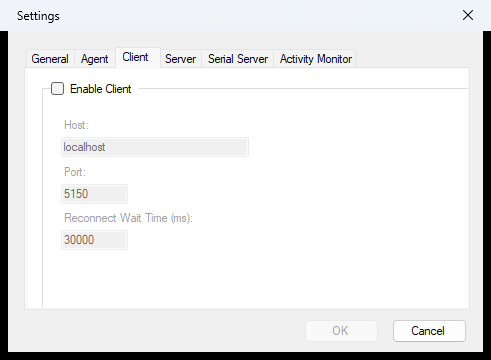
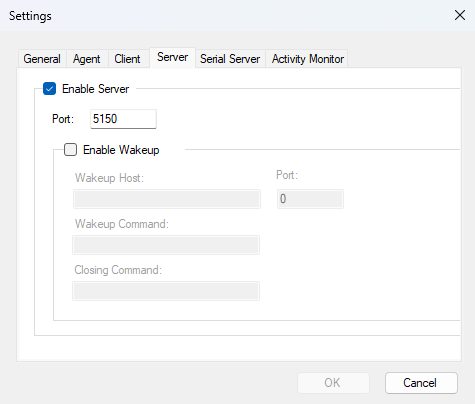
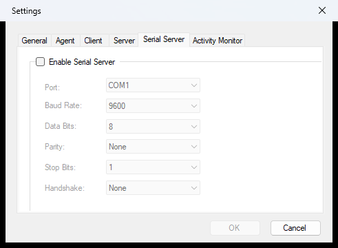
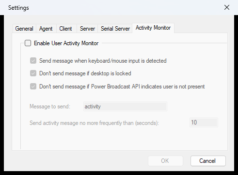
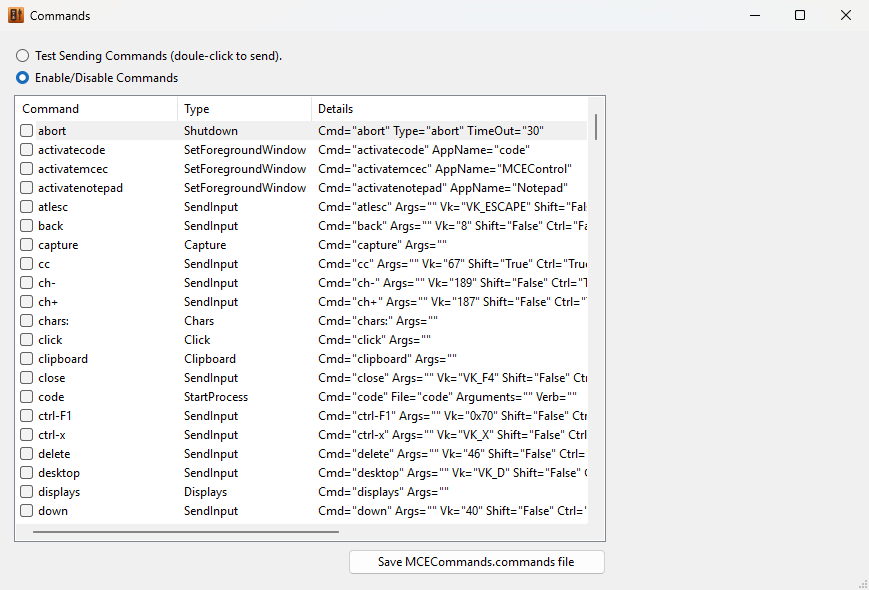
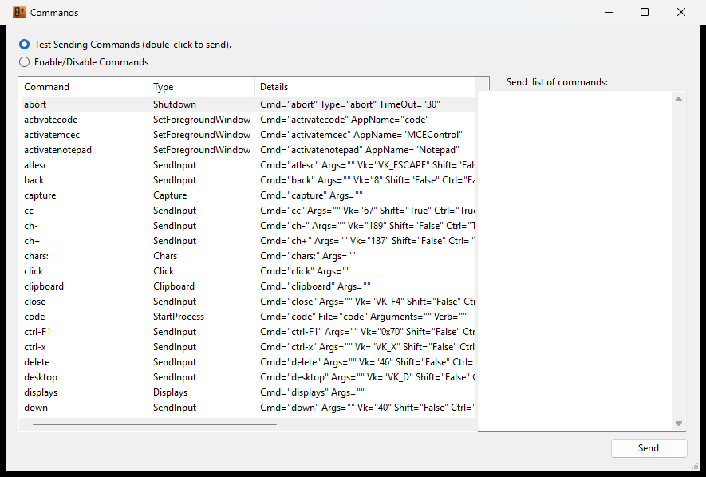

<!--
// Copyright © Kindel, LLC - http://www.kindel.com
// Published under the MIT License - Source on GitHub: https://github.com/tig/mcec
-->

# MCEC for Home Automation & Remote Control

**MCEC** (Model Context Environment Controller) began life as **MCE Controller**, and its original job is
still first-class: it is a robust, battle-tested way to control a Windows PC from a home-automation or
remote-control system. It runs in the background listening on the network (or a serial port) for
*Commands*, and translates them into actions on the PC: keystrokes, text input, mouse movement, window
messages, and launching programs.

Any remote control, home-control system, or application that can send text strings over **TCP/IP** or an
**RS-232 serial port** can use MCEC to drive a Windows PC. It works great with systems such as
[**Control4**](https://www.control4.com/), [**iRule**](http://www.iruleathome.com/),
[**Crestron**](http://www.crestron.com/), and
[**Premise Home Control**](http://cocoontech.com/forums/forum/51-premise-home-control/).

MCEC was originally built to integrate a Windows Media Center home-theater PC (HTPC) into a Crestron
whole-house A/V system, but it is general enough for any control system that can send text to a TCP/IP
port or serial port.

> **Looking for the agent/AI side?** MCEC 3.0 is also an opt-in automation server for AI agents over the
> **Model Context Protocol (MCP)**: see the [Agent Server user guide](environment-controller.md) and the
> [main documentation](configuration.md). This page covers the classic remote-control features, which are
> unchanged and remain the default behavior.

For example:

* The command `netflix` will cause the Netflix application to start.
* The command `maximize` will maximize the current window (equivalent to the window menu's "Maximize").
* The command `chars:Hello World!` types the text "Hello World!" as though typed on the keyboard.
* The command `VK_MEDIA_NEXT_TRACK` jumps the running media player (Spotify, Windows Media Player, etc.) to
  the next track, just as if the user pressed the "next track" key.

The set of commands MCEC supports is extensible through a configuration file (`mcec.commands`). If MCEC does
not natively support a function you want, you can add new commands easily.

## Windows PC Control Capabilities

By default MCEC supports over 250 built-in commands for controlling a Windows PC remotely. The command
engine can:

* Simulate key presses (e.g. Alt-Tab, or Win-S) with `SendInput` commands.
* Simulate the mouse with `mouse:` commands.
* Simulate Windows messages (e.g. `WM_SYSCOMMAND` / `SC_MAXIMIZE`) with `SendMessage` commands.
* Start processes (e.g. run `notepad.exe`) with the `StartProcess` command.
* Change window focus with the `SetForegroundWindow` command.
* Send text (simulate typing) with the `chars:` command.
* Pace (slow down) commands, and wait for apps to open with the `pause` command.
* Shut down, restart, sleep, or hibernate the PC with `Shutdown` commands.
* Be extended to suit your needs through an `mcec.commands` file.

> **Same vocabulary, two front doors.** This command language is shared. A home-automation system sends
> these commands over TCP/serial; an AI agent can send the very same raw command strings through the MCP
> [`send_command`](environment-controller.md) tool. Everything on this page applies to both.

## Transports: Client, Server, and Serial

MCEC can act as a TCP/IP **client**, a TCP/IP **server**, and/or a **serial server**; simultaneously if
you like. All are configured from the **File ▸ Settings…** dialog, and each transport's status shows on the
main window's status bar (green = connected, red = active but not connected, gray = inactive;
double-click a status to toggle it).

### The Client tab

When acting as a client, MCEC repeatedly tries to connect to a host and waits for commands to be sent to
it. MCEC sends nothing to the host by default.



* **Enable Client**: enables/disables the TCP/IP client. If enabled:
* **Host**: the IP address or host name of the server MCEC connects to.
* **Port**: the port MCEC connects to.
* **Reconnect Wait Time (ms)**: how long (default 30000 ms / 30 s) MCEC waits before retrying a dropped
  connection.

### The Server tab

By default MCEC acts as a TCP/IP server listening on port **5150**. When acting as a server, MCEC opens the
port and waits for clients to connect, then processes incoming commands until the client disconnects. The
server supports any number of simultaneous connections and speaks the Telnet protocol.



* **Enable Server**: enables/disables the TCP/IP server. If enabled:
* **Port**: the port MCEC listens on (default 5150).
* **Enable Wakeup**: if enabled, MCEC connects to the specified host/port on startup, sends the "Wakeup
  command," and disconnects; on shutdown it sends the "Closing command." Useful when a remote client needs
  to know MCEC is ready (e.g. after the control system reboots).

#### Restricting the Server to this machine (bind address)

The command server has **no socket authentication**; anything that can reach the port can send commands
that press keys, move the mouse, and start processes. By default the server binds to **all network
interfaces** (`0.0.0.0`), so it is reachable from every host on your LAN/VPN (and from anywhere the port is
forwarded). This preserves the long-standing behavior for setups driven from another machine on a trusted
network.

If nothing off this machine needs to connect (for example, another local app talks to MCEC over
`localhost`), restrict the server to loopback so the unauthenticated port is not exposed on the network.
Edit `mcec.settings` and set:

```xml
<SocketServerBindAddress>127.0.0.1</SocketServerBindAddress>
```

Accepted values (case-insensitive):

| Value | Binds to |
| --- | --- |
| `0.0.0.0`, `any`, `*`, or empty/blank | All interfaces (default; LAN/VPN reachable) |
| `::` | All interfaces, IPv6 only (binds IPv6 `Any`) |
| `127.0.0.1`, `localhost`, `loopback` | This machine only (recommended for single-machine setups) |
| `::1` | IPv6 loopback (this machine only) |
| a specific local IP (e.g. `192.168.1.50`) | That interface only |

When the resolved bind is **not** loopback (e.g. the `0.0.0.0` default), MCEC writes a loud **WARN** to the
log at startup noting the command port is unauthenticated and reachable off-box, with the recommendation to
set `127.0.0.1`. An unparseable value is rejected with an error in the log and **falls back to loopback**
(`127.0.0.1`) rather than silently exposing the port. Restart MCEC after editing the setting.

### The Serial Server tab

When the Serial Server is enabled, MCEC opens the specified COM port (e.g. COM1) and waits for commands.



* **Enable Serial Server**: enables/disables the serial server (disabled by default). If enabled:
* **Port**: the serial port MCEC listens on (e.g. COM1).
* **Baud Rate**: the serial port speed.
* **Data Bits**, **Parity**, **Stop Bits**, **Handshake**; the serial port configuration.

## User Activity Monitor

MCEC's **User Activity Monitor** sends a command (`activity` by default) to your home-automation system
when a user is using the PC. It knows the PC is in use by watching keyboard and mouse activity; if the
mouse is moving or keys are being pressed, the PC is in use. This is useful for adding context to a room
occupancy sensor.



* **Enable User Activity Monitor**: enables/disables the monitor (disabled by default). If enabled:
* **Command to send**: the string sent when activity is detected (`activity` by default).
* **Debounce time (seconds)**: the activity message is sent no more frequently than this.

See the [Control4 User Activity Driver](https://github.com/tig/User_Activity) for an example Control4
driver that uses this feature.

## Enabling or Disabling Commands

By default **all** commands are disabled, to reduce the surface area MCEC exposes on the network. Use the
**Commands Window** (**Commands ▸ Enable and Test Commands…**) to enable/disable commands.



Clicking **Save mcec.commands file** saves changes immediately. The `.commands` file is **not** saved
automatically on exit; MCEC only writes it in response to that explicit action, so a crash or power loss
can never corrupt it mid-write on the way out.

## Testing MCEC

MCEC's built-in TCP/IP client can send commands to another instance of MCEC on the same or a different PC.
If both the Client and Server in a single instance are pointed at `localhost` on the same port, they can
connect to each other, an easy way to test commands.

To configure "test mode":

1. Open **File ▸ Settings…**.
2. On the **Client** tab, check **Enable Client** and enter `localhost` as the **Host**.
3. On the **Server** tab, check **Enable Server**.
4. Click **OK**.
5. Open **Commands ▸ Enable and Test Commands…** and start testing.



The **Commands Window** lists every command MCEC is configured to listen for, so you can see the full set
and test them:

* Double-click any command to send it from the Client to the Server. (Be careful; double-clicking
  `shutdown` will literally shut down your PC.)
* Type into the **Send "chars:" command** box and press **Send** to send a `chars:` command.
* Type a command (or one command per line) into the **Send any command** box and press **Send**.

As a quick test, send these three lines (the 2nd line is a single space):

    shiftdown:lwin
    x
    shiftup:lwin

This pops up the Windows Quick Link Menu, just as if the user typed `Win-X`.

Turn on the **Activity Monitor** while in test mode and you'll see events in the log when activity is
detected.

### Using PuTTY

[PuTTY](http://www.chiark.greenend.org.uk/~sgtatham/putty/) is a free terminal emulator (and Telnet/SSH
client) that works well for testing MCEC.

**TCP/IP:** Run PuTTY, set **Host Name** to `localhost` (or the PC running MCEC), set **Port** to MCEC's
listen port (e.g. 5150), set **Connection Type** to **Raw**, and click **Open**. Type commands and watch
how MCEC reacts.

**Serial:** PuTTY can also connect over serial; set the COM-port settings and choose the **Serial**
connection type.

## The Command Language

MCEC works with ***Commands***: text strings like `greenbutton`, `hibernate`, and `winkey` that MCEC
listens for and acts on. Each command has a **Type**. When MCEC receives a command it performs an action on
the PC it is running on; the action depends on the command's type and parameters.

> **Security:** As of version 2.2.1, **all** commands are disabled by default to reduce the network surface
> area. Use the **Commands Window** to enable the ones you need.

### Command Types

| Type | Purpose |
|------|---------|
| **`StartProcess`** | Starts a process (executable, shortcut, or URI). Supports embedded `nextCommand` elements to run other commands after the process starts. |
| **`SetForegroundWindow`** | Brings the specified window to the foreground. |
| **`Shutdown`** | Shuts down, restarts, sleeps, or hibernates the host. |
| **`SendMessage`** | Sends Windows messages to windows (e.g. `mcemaximize` sends Media Center full-screen). |
| **`SendInput`** | Sends keyboard input as though typed on a keyboard. |
| **`Chars`** | Sends text. |
| **`Mouse`** | Sends mouse movement and button actions. |
| **`Pause`** | Pauses before the next command runs (in milliseconds). |
| **Built-in** | Single characters, `VK_` codes, `chars:`, `shiftdown:`, `shiftup:`, `pause:`, and `mcec:`. |

MCEC command names (`Cmd` values) are **not** case-sensitive; `VK_UP` equals `vk_up`, and `shutdown`
equals `ShutDown`.

### Simulating Keyboard Input

Any Windows virtual key code is supported by default, in the form `VK_<key name>`. For example:

```
VK_ESCAPE
VK_LWIN
VK_VOLUME_MUTE
VK_VOLUME_UP
VK_MEDIA_PLAY_PAUSE
VK_F1
```

A full list of virtual key codes is on
[this MSDN page](http://msdn.microsoft.com/en-us/library/dd375731.aspx).

> Since Windows 10, `VK_MEDIA_*` keys (play/pause, next/prev track, volume) are only delivered to the
> **foreground** application; this is a Windows platform behavior, not something MCEC controls. If a media
> key seems to do nothing, bring the target app to the foreground first (e.g. with `SetForegroundWindow` or
> a launch sequence), then send the key.

Sending `chars:` plus text simulates typing that text. `chars:3` types `3`; `chars:Hello` types the
letters H-e-l-l-o (including the shift for the capital). The text after `chars:` can include *character
escapes* for unprintable/Unicode characters: `chars:\\` sends `\`, `chars:☺` sends `☺`, and
`chars:€` sends `€`. (The supported escapes are
[documented here](https://docs.microsoft.com/en-us/dotnet/standard/base-types/character-escapes-in-regular-expressions).)

How `chars:` interacts with modifier keys (shift/ctrl/alt/win) is app-dependent; for fine-grained control
use `SendInput` commands instead.

Sending a single character without `chars:` (e.g. just `c`) is equivalent to a `SendInput` command (a
single key press). There is no difference between sending `a` and `A`; use `shiftdown:`/`shiftup:` to hold
modifier keys. (The `chars:` command must be enabled for single-character commands to work.)

### Simulating Shift, Control, Alt, and Windows keys

To hold or release a modifier key, send a `shiftdown:` or `shiftup:` command:

    shiftdown:[shift|ctrl|alt|lwin|rwin]
    shiftup:[shift|ctrl|alt|lwin|rwin]

For example, to type `Test!`:

    shiftdown:shift
    t
    shiftup:shift
    e
    s
    t
    shiftdown:shift
    1
    shiftup:shift

This is the same as sending `chars:Test!`. The scheme also sends ctrl-, alt-, and win- chords; e.g.
ctrl-s:

    shiftdown:ctrl
    s
    shiftup:ctrl

### Mouse Commands

The general format is:

    mouse:<action>[,<param>,...,<param>]

| Action | Meaning |
|--------|---------|
| `lbc` / `lbdc` / `lbd` / `lbu` | Left button click / double-click / down / up |
| `rbc`, `rbdc`, `rbd`, `rbu` | Same for the right button |
| `mbc`, `mbdc`, `mbd`, `mbu` | Same for the middle button |
| `xbc,n` (etc.) | X-button *n* click (`mouse:xbc,3`) |
| `mm,x,y` | Move the mouse *x*, *y* pixels relative (`mouse:mm,7,-3` → right 7, up 3) |
| `mt,x,y` | Move to an absolute position on the primary display in 0–65535 units (`mouse:mt,0,65535` → bottom-left corner) |
| `mtv,x,y` | Move to an absolute position on the **virtual desktop** in 0–65535 units (`mouse:mtv,65535,0` → top-right corner) |
| `mtp,x,y` | Move to an absolute **screen pixel**; the same coordinate space the agent `query`/`find`/`displays` tools use. Takes real pixels and normalizes across the virtual desktop, so negative or secondary-monitor coordinates land correctly (`mouse:mtp,812,562`). |
| `hs,n` | Horizontal scroll *n* clicks (positive = right) |
| `vs,n` | Vertical scroll *n* clicks (positive = forward/away) |
| `drag,x1,y1,x2,y2[,x3,y3,…]` | Press at the first point, move through every subsequent point with the button held, and release at the last; a full press → move-path → release gesture dispatched **atomically** (nothing else interleaves). Coordinates are absolute screen pixels (normalized across the virtual desktop internally). Use it to resize a window by its border, move one by its title bar, drag a slider, marquee-select, or reorder (`mouse:drag,400,300,700,500`). Agents get a higher-level [`drag`](environment-controller.md) tool that also accepts UI Automation elements as endpoints. |

When sending mouse movements it helps to hide the MCEC window; the live log display consumes resources and
can make motion jerky.

### mcec: Commands

The following commands control MCEC itself. Values are returned as `command=value`:

* **`mcec:ver`**: the version number.
* **`mcec:exit`**: causes MCEC to exit.
* **`mcec:cmds`**: lists all commands.

## Defining Your Own Commands

MCEC ships with nearly 300 built-in commands. The first time it runs, it creates an `mcec.commands` file
containing all built-in commands with `Enabled="false"` on every one. You can then edit `mcec.commands` to
enable, override, or add commands. (Use **Commands ▸ Open commands folder…** to find the file.)

Deleting a built-in command from the file does not remove it permanently; MCEC re-adds built-ins whenever
it saves, but with `Enabled="false"`, which is functionally equivalent to deleting them.

### File Format

The file is XML and must include the headers. Commands are defined within the `<commands>` element:

```xml
<?xml version="1.0"?>
<mcecontroller xmlns:xsd="http://www.w3.org/2001/XMLSchema" xmlns:xsi="http://www.w3.org/2001/XMLSchema-instance" version="3.0.0">
  <commands xmlns="http://www.kindel.com/products/mcecontroller">
    ...
  </commands>
</mcecontroller>
```

Whenever `mcec.commands` changes it is reloaded; no restart needed. The general form of a command is:

```xml
<type Cmd="text to trigger on" Args="optional args" ... />
```

**Case sensitivity:** XML element and attribute names are case-insensitive (`ctrl` = `Ctrl`), and the
`Cmd` value is case-insensitive (`MonitorOff` = `monitoroff`). Some attribute values are case-sensitive;
`true`/`false` must be lowercase, and in `SendInput`, `Ctrl="true"` works but `Ctrl="False"` does not.

Do not define a command whose name is a single character; it interferes with single-character key
presses.

### Nesting

Commands can chain by nesting elements. Nested commands run after the started application begins processing
window messages. For example, launch Notepad, wait 1 second, then type text:

```xml
<StartProcess Cmd="notepad" File="notepad.exe">
    <Pause Args="1000"/>
    <Chars Cmd="test" Args="this is a test." />
</StartProcess>
```

### SendInput Commands

`SendInput` commands simulate key presses. Any combination of shift, ctrl, alt, and left/right Windows
keys can accompany any virtual key code. `SendInput` accepts single characters (e.g. `x` or ` `), hex
codes (e.g. `0x2a`), decimal codes, or `VK_` names. Under the covers the Windows `SendInput()` API is used;
keystrokes always go to the foreground window.

```xml
<SendInput Cmd="mypictures" vk="P" Shift="false" Ctrl="true" Alt="false" />
<SendInput Cmd="winx" vk="VK_X" Win="true"/>
```

Each of these does the same thing (a space), illustrating the equivalent key encodings:

```xml
<SendInput Cmd="space" vk="VK_SPACE" Enabled="true"/>
<SendInput Cmd="space" vk=" " Enabled="true"/>
<SendInput Cmd="space" vk="\u0020" Enabled="true"/>
<SendInput Cmd="space" vk="0x20" Enabled="true"/>
```

### SendMessage Commands

`SendMessage` commands send a Windows message (via the `SendMessage()` API) to the foreground window; or
to a specific window if its class name is specified. `Msg`, `wParam`, and `lParam` must be in **decimal**
(not hex).

For example, `WM_SYSCOMMAND` with `SC_MAXIMIZE` (`274` / `61488`) maximizes the window whose class is
`ehshell`:

```xml
<SendMessage Cmd="mce_maximize" ClassName="ehshell" Msg="274" wParam="61488" lParam="0" />
```

Other useful examples:

```xml
<!-- WM_SYSCOMMAND, SC_SCREENSAVE -->
<SendMessage Cmd="screensaver" Msg="274" wParam="61760" lParam="0" />
<!-- WM_SYSCOMMAND, SC_MONITORPOWER, 2 = off, -1 = on -->
<SendMessage Cmd="monitoroff" Msg="274" wParam="61808" lParam="2" />
<SendMessage Cmd="monitoron"  Msg="274" wParam="61808" lParam="-1" />
```

See the [MSDN `WM_SYSCOMMAND` docs](http://msdn.microsoft.com/en-us/library/ms646360(v=VS.85).aspx) for more.

### StartProcess Commands

`StartProcess` commands start programs and support chaining via nested command elements (the first embedded
command runs after the app starts processing window messages).

```xml
<StartProcess Cmd="code"    File="code" Arguments="foo.cs" />
<StartProcess Cmd="tada"    File="C:\Windows\Media\tada.wav" Verb="Open" />
<StartProcess Cmd="term"    File="shell:AppsFolder\Microsoft.WindowsTerminal_8wekyb3d8bbwe!App" />
<StartProcess Cmd="netflix" File="shell:AppsFolder\4DF9E0F8.Netflix_mcm4njqhnhss8!Netflix.App" />
```

### Shutdown Commands

```xml
<Shutdown Cmd="shutdown"  Type="shutdown" Timeout="30"/>
<Shutdown Cmd="restart"   Type="restart"/>
<Shutdown Cmd="abort"     Type="abort"/>
<Shutdown Cmd="standby"   Type="standby"/>
<Shutdown Cmd="hibernate" Type="hibernate"/>
```

### SetForegroundWindow Commands

The `SetForegroundWindow` command sets a process's main window to the foreground:

```xml
<SetForegroundWindow Cmd="activatenotepad" AppName="Notepad"/>
```

`AppName` is the "friendly process name" of an app (the name shown in Task Manager's Details tab). MCEC
uses `GetProcessesByName` and picks the first process that has a main window.

> Note: the `ClassName` attribute is mis-named and preserved only for backwards compatibility. Since
> Windows Vista, one app cannot set arbitrary windows of another app to the foreground.

### Chars Commands

`<Chars Cmd="foo" Args="bar"/>` defines `foo` so that receiving `foo` types `bar`, exactly as if
`chars:bar` had been received.

### Pause Commands

`<Pause Cmd="pause3sec" Args="3000"/>` pauses 3 seconds, the same as sending `pause:3000`. Pause delays add
to any delay from the **Default command pacing** setting.

## Disabling All Internal Commands

To force MCEC to listen only to commands defined in `mcec.commands`, create the registry key
`HKEY_LOCAL_MACHINE\SOFTWARE\Kindel\MCE Controller` and set the DWORD value `DisableInternalCommands` to
anything other than 0. (The "MCE Controller" key name and the `Kindel Systems` fallback are kept for
back-compat.) This is a machine-wide setting affecting all instances of MCEC.

## Usage Notes (Media Center)

* `mcestart` launches Media Center and maximizes it. To skip the maximize, remove the embedded
  `nextCommand` element from the `mcestart` command in `mcec.commands`.
* For MCEC to control Media Center, Media Center must be the foreground window. Use `mceactivate` to bring
  it forward if it's already running, or just use `mcestart`.
* `greenbutton` is often better than `mcestart`; it's the equivalent of the green button on a Windows
  remote and always goes to the Media Center Start screen (but does not maximize the window).

## More Examples

See [Example Commands](example_commands.md) for community-contributed `mcec.commands` recipes (Netflix,
HDHomeRun, Media Center, window tricks, and more).
