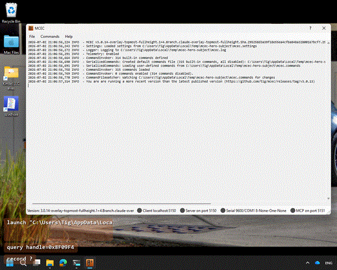

# MCEC

**MCEC**: the **Model Context Environment Controller**; is eyes, hands, and a safe front door for AI agents on Windows.

It is a small, self-contained native Windows daemon that a computer-use model can **mount, see through, and drive**. An agent runs the loop *observe → target → act → observe*, and MCEC gives it all four: capture a window as a PNG (composited WinUI/WPF surfaces included), query the UI Automation tree, find and wait for controls, launch apps, and actuate keyboard/mouse/window input; exposed to agents and scripts over the **Model Context Protocol (MCP)** (stdio via `mcec.exe --mcp`, or a localhost HTTP floor).

Be clear-eyed about what enabling it means: **everything a user can do, an agent can do**; there is no sandbox, and the gates decide *whether* an agent gets your hands, not *how much*. So every agent capability is **opt-in, disabled by default, localhost-bound, narrated by an on-screen overlay, and loudly audit-logged**, with a global emergency-stop hotkey and disposable isolated sessions so the operator stays in control. See the [Agent Server user guide](agent-server.md), [Agent safety](safety-emergency-stop-and-provisioning.md), and [AGENTS.md](https://github.com/tig/mcec/blob/main/AGENTS.md) (agent guidance + dogfood recipe).

**MCEC** is also the same battle-tested **remote control for home-automation systems** it has always been. It runs in the background listening on the network (or a serial port) for commands, and translates them into keystrokes, text input, mouse moves, window messages, and app launches. Any remote control or home-control system that supports TCP/IP or RS-232 (such as [**Control4**](https://www.control4.com/), [**iRule**](http://www.iruleathome.com/), [**Crestron**](http://www.crestron.com/), and [**Premise Home Control**](http://cocoontech.com/forums/forum/51-premise-home-control/)) can use **MCEC** to control a Windows PC. The 3.0 agent surface is purely additive; every existing home-automation feature is unchanged. See [Home Automation & Remote Control](home-automation.md).

**[Full MCEC Documentation](documentation.md)**

## Download & Install

**[Download and Install the Latest Version](https://github.com/tig/mcec/releases)**

## Version History

* **3.0 (2026)**: Rebranded to the **Model Context Environment Controller**. Agent automation over MCP: observation (`capture`/`query`/`record`), targeting (`find`/`wait-for`), actuation (`invoke`/`launch`/`drag`/`click`), emergency stop, and isolated session provisioning; all opt-in and off by default.
* **2.x (2019)**: Major rework: robust client/server, User Activity Monitor (occupancy sensing), Commands Window with built-in test mode, per-monitor DPI support, config in `%APPDATA%`.
* **1.x (2004–2017)**: Born as "MCE Controller" for Windows Media Center HTPCs. Grew keyboard/mouse/window-message simulation, `chars:` with Unicode escapes, serial support, multi-client TCP, and the `.commands` extension file. Moved from SourceForge to CodePlex to GitHub.

See [Releases](https://github.com/tig/mcec/releases) for the full history and release notes.
