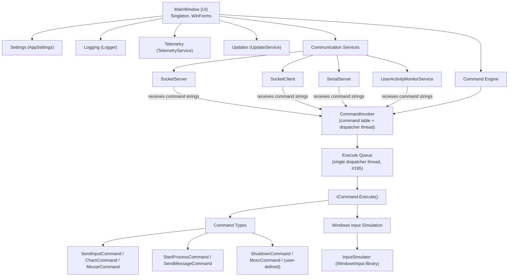
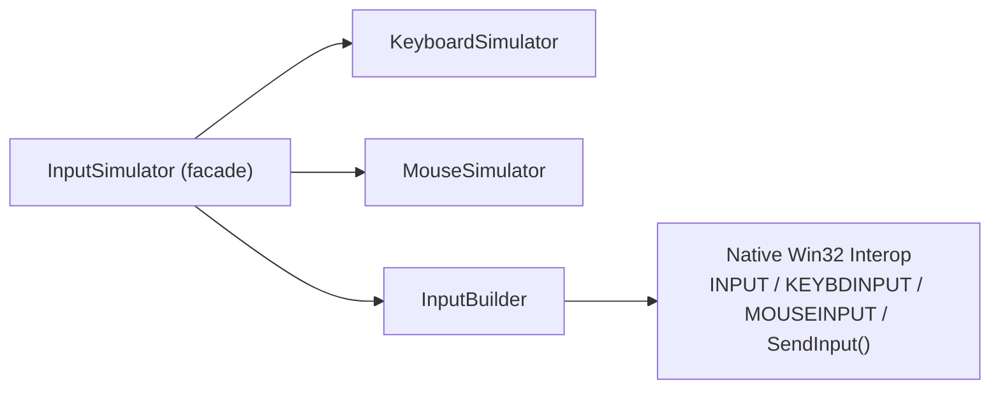

# MCEC Architecture

## Overview

MCEC is a Windows desktop application built on .NET 10 (WinForms) that enables remote control of a Windows PC through multiple communication channels (TCP/IP sockets and serial ports). It receives commands over these channels and executes them by simulating keyboard/mouse input, launching processes, sending Windows messages, and more.

**Primary Use Case**: Home theater PC (HTPC) automation and control, particularly for Windows Media Center environments.

## High-Level Architecture



## Core Components

### 1. MainWindow (Entry Point & Orchestrator)

**Location**: `MainWindow.cs`

**Responsibilities**:
- Singleton, but explicitly assigned (#209): `Program.Main`'s GUI path constructs the one instance and sets `MainWindow.Instance` before `Application.Run`. It is **not** lazily constructed; touching `Instance` before assignment (or ever, in headless `--mcp` mode) throws a pointed exception. Code below the UI layer must use the `AgentRuntime` seam (`Invoker`, `SendLine`, `RequestShutdown`, `MessageWindowHandle`) instead; MainWindow registers itself as the seam's `IAppHost` when settings are applied.
- Lifecycle management for all services
- UI presentation (WinForms with MenuStrip, StatusStrip, system tray icon)
- Coordination between communication services and command execution
- Settings management and persistence
- Window message handling (WM_POWERBROADCAST, WM_QUERYENDSESSION)

**Key Dependencies**:
- All service components (SocketServer, SocketClient, SerialServer, UserActivityMonitorService)
- CommandInvoker (command execution engine)
- Logger, TelemetryService, UpdateService

### 2. Communication Services

All services inherit from `ServiceBase` which provides:
- Common notification pattern via delegates
- Status management (Started, Waiting, Connected, Sleeping, Stopped)
- Error handling
- Telemetry integration

#### 2.1 SocketServer
**Location**: `Services\SocketServer.cs`

**Purpose**: TCP/IP server that listens for incoming client connections

**Features**:
- Listens on configurable port (default: 5150)
- Supports multiple concurrent clients
- Each client gets a unique ServerReplyContext
- Optional "wakeup" command broadcasting on startup/shutdown
- Asynchronous (APM) accept/receive: `BeginAccept`/`BeginReceive` callbacks, not a thread per client

#### 2.2 SocketClient
**Location**: `Services\SocketClient.cs`

**Purpose**: TCP/IP client that connects to remote servers

**Features**:
- Connects to configurable host:port
- Auto-reconnect with configurable delay
- Bidirectional communication
- Persistent connection management

#### 2.3 SerialServer
**Location**: `Services\SerialServer.cs`

**Purpose**: Serial port communication

**Features**:
- Configurable serial parameters (baud rate, parity, data bits, stop bits, handshake)
- RS-232 communication for hardware integration
- Event-driven data reception

#### 2.4 UserActivityMonitorService
**Location**: `Services\UserActivityMonitorService.cs`

**Purpose**: Monitors user activity and system events

**Features**:
- Mouse/keyboard input detection
- Session lock/unlock detection
- Power management events (sleep, wake, user presence)
- Debouncing to prevent command flooding
- Generates configurable activity commands

**Dependencies**: Uses the first-party `MCEControl.Hooks` (`Hooks\`) `HookManager` for low-level hook management (adopted from the vendored Gma.UserActivityMonitor fork in #214)

### 3. Command System (Command Pattern)

#### 3.1 CommandInvoker
**Location**: `Commands\CommandInvoker.cs`

**Purpose**: Central command registry and execution queue

**Architecture**:
- Hashtable-based command lookup (case-insensitive)
- ConcurrentQueue for command execution
- Combines built-in commands with user-defined commands from `mcec.commands` file
- Parses command strings and routes to appropriate command instances

**Command Sources**:
1. **Built-in commands**: Defined in Command-derived classes (disabled by default for security)
2. **User commands**: Loaded from XML file `mcec.commands`

#### 3.2 Command Base Classes

**Location**: `Commands\Command.cs`

**ICommand Interface**:
```csharp
public interface ICommand {
    bool Execute();
    ICommand Clone(Reply reply);
}
```

**Command Abstract Class**:
- Base for all command types
- XML serialization support
- Enabled/disabled flag (security)
- Support for nested/embedded commands
- Telemetry tracking
- Reply context for bidirectional communication
- `Clone(Reply)` is MemberwiseClone-based (#207): every field; all serializable state is
  value/string-typed; is copied by construction, then the fresh `Reply` is set and
  `EmbeddedCommands` deep-cloned. Subclasses do not (and must not need to) override it to copy
  fields; a reflection hygiene test round-trips every public settable property of every command.

#### 3.3 Command Types

All commands are located in the `Commands\` directory:

| Command Type | Purpose | Key Features |
|--------------|---------|--------------|
| **SendInputCommand** | Keyboard simulation | Uses WindowsInput library; supports modifier keys (Shift, Ctrl, Alt, Win); virtual key codes |
| **CharsCommand** | Text input | Types character sequences; uses SendInput |
| **MouseCommand** | Mouse control | Movement, clicks, double-clicks, wheel scrolling |
| **StartProcessCommand** | Launch applications | Process.Start wrapper; supports arguments, verbs; can embed commands to execute after process starts |
| **SendMessageCommand** | Windows messages | Posts WM_* messages to windows; PostMessage/SendMessage |
| **SetForegroundWindowCommand** | Window focus | Brings window to foreground |
| **ShutdownCommand** | System power | Shutdown, restart, logoff, sleep, hibernate |
| **PauseCommand** | Timing control | Thread.Sleep for command pacing |
| **McecCommand** | Internal control | Controls MCEC itself (reload, shutdown, etc.) |
| **CaptureCommand** | Agent: observe | Screenshot a window/region via `PrintWindow` (`PW_RENDERFULLCONTENT`) → PNG/base64 |
| **QueryCommand** | Agent: observe | Dump the UI Automation tree of a window (via FlaUI) |
| **FindCommand** | Agent: target | `find` / `wait-for` a UIA element by name/automation-id/class with a timeout |
| **InvokeCommand** | Agent: act | Drive a UIA element pattern (Invoke/Toggle/Value/SetFocus) |

> **MCEC 3.0 agent subsystem (`src/Agent/`, `Services/AgentServer.cs`).** The four agent
> commands above add *observation* and *targeting* on top of the existing actuation core, and
> are exposed as Model Context Protocol (MCP) tools over stdio (`mcec.exe --mcp`) and a
> localhost HTTP/JSON floor. They are **disabled by default** behind a dedicated opt-in
> (`AppSettings.AgentCommandsEnabled`, separate from the actuation enable), bind to localhost
> only, and loudly audit-log every action. The engine reaches settings/invoker through the
> UI-agnostic `AgentRuntime` seam so it runs headless (no `MainWindow`). See
> [`docs/environment-controller.md`](../docs/environment-controller.md) (users) and
> [`docs/agent-server-architecture.md`](../docs/agent-server-architecture.md) (devs).

**Nested Commands**:
Commands can contain embedded commands that execute after the parent completes. Example:
```xml
<StartProcess Cmd="notepad" File="notepad.exe">
    <Pause Args="100" />
    <Chars Args="Hello World" />
    <SendInput vk="VK_RETURN" />
</StartProcess>
```

### 4. Windows Input Simulation

**Location**: `WindowsInput\` namespace

**Purpose**: Low-level keyboard and mouse input simulation using Win32 SendInput API

**Architecture**:


**Key Components**:
- **InputBuilder**: Constructs INPUT structures for SendInput
- **KeyboardSimulator**: Virtual key press/release, modifier keys, text input
- **MouseSimulator**: Absolute/relative movement, button clicks, wheel scrolling
- **WindowsInputDeviceStateAdaptor**: Queries key/button states
- **WindowsInputMessageDispatcher**: Sends INPUT arrays to Win32 SendInput API

**Win32 Integration**:
- P/Invoke declarations in `WindowsInput\Native\NativeMethods.cs` (no `unsafe` code)
- Uses Windows.h structures (INPUT, KEYBDINPUT, MOUSEINPUT)
- Virtual key codes (VirtualKeyCode enum)
- Mouse and keyboard flags

### 5. Supporting Services

#### 5.1 AppSettings
**Location**: `Services\AppSettings.cs`

**Purpose**: Application configuration management

**Storage**: XML serialization to `mcec.settings`

**Features**:
- Server/Client/Serial configuration
- UI preferences (opacity, window position/size)
- Activity monitor settings
- Telemetry filtering via `[SafeForTelemetry]` attributes
- Adapts to Program Files vs user directory installation

#### 5.2 Logger
**Location**: `Helpers\Logger.cs`

**Purpose**: Centralized logging

**Features**:
- Log4net wrapper
- Dual output: file and UI TextBox
- Configurable log levels
- Exception dump formatting

#### 5.3 TelemetryService
**Location**: `Services\TelemetryService.cs`

**Purpose**: Anonymous usage analytics

**Features**:
- Azure Application Insights integration
- Opt-in via registry key
- PII protection (user-defined commands not tracked)
- Session tracking with anonymized user ID (SHA256 hash)
- Metrics: command usage, connection times, settings

**Privacy**:
- User ID: SHA256 hash of username+machine name
- Only built-in command names are tracked
- User-defined commands tracked as `<userDefined>`
- Settings filtered by `[SafeForTelemetry]` attribute

#### 5.4 UpdateService
**Location**: `Services\UpdateService.cs`

**Purpose**: Automatic update checking

**Features**:
- GitHub Releases API integration (Octokit library)
- Semantic version comparison
- Update notification dialog
- Debug builds check for pre-releases

#### 5.5 CommandFileWatcher
**Location**: `Helpers\CommandFileWatcher.cs`

**Purpose**: Hot-reload of command definitions

**Features**:
- Watches `mcec.commands` file
- Triggers CommandInvoker reload on file changes
- FileSystemWatcher wrapper with debouncing

### 6. Win32 Integration Layer

**Purpose**: Small, per-subsystem P/Invoke declarations for the Windows APIs MCEC actually calls. There is no shared native library and no `unsafe` code; each subsystem declares only what it uses, and no import is declared twice. (The vendored `Microsoft.Win32.Security` fork (token manipulation, ACLs, SIDs) was dead code and was deleted in #210.)

**The four islands**:
- **`Win32NativeMethods.cs`** (core app): window messaging; `SendMessage`, `PostMessage`, `SetForegroundWindow`, plus the `WM_SYSCOMMAND`/`SC_CLOSE` constants. Used by MainWindow (hide-on-startup), SendMessageCommand, and SetForegroundWindowCommand.
- **`WindowsInput\Native\NativeMethods.cs`**: input simulation; `SendInput`, `GetKeyState`/`GetAsyncKeyState`, `GetMessageExtraInfo`, `FindWindow`, `GetClassName`.
- **`Hooks\`** (`HookNativeMethods.cs` + `PowerNativeMethods.cs`): global low-level hooks (`SetWindowsHookEx`/`UnhookWindowsHookEx`/`CallNextHookEx`, `IntPtr` hook handles) and power-broadcast notifications. First-party since #214 (formerly the vendored `Gma.UserActivityMonitor` fork).
- **`Agent\AgentNativeMethods.cs`**: agent observation; `PrintWindow`, window rect/text/class metadata, `EnumWindows`, per-monitor DPI, and the layered-window plumbing for the command overlay.

### 7. Global Input Hooks (MCEControl.Hooks)

**Location**: `Hooks\` (namespace `MCEControl.Hooks`)

**Purpose**: Global input hooks for activity monitoring and the emergency stop (#135)

**Features**:
- Low-level mouse and keyboard hooks (SetWindowsHookEx), installed on first subscribe / uninstalled on last unsubscribe
- Injected-key detection (`LLKHF_INJECTED`) on the `KeyDownExt`/`KeyUpExt` events for the emergency stop
- Power-setting notification P/Invokes (`PowerNativeMethods`)

First-party since #214: adopted from the vendored `Gma.UserActivityMonitor` fork (a dead 2004
CodeProject sample) because it is load-bearing for the emergency stop; only the used surface was kept.

## Data Flow

### Incoming Command Flow

1. **Network/Serial Input**: SocketServer, SocketClient, or SerialServer receives text.
2. **`MainWindow.ReceivedData(Reply, String)`**: producer-only, enqueues on the transport's own thread (no UI marshaling).
3. **`CommandInvoker.Enqueue(Reply, String)`**: parses the command string, looks up the `Command` in the hashtable, clones it with the `Reply` context, enqueues it to the dispatcher's queue, and recursively enqueues any embedded commands.
4. **`CommandInvoker` dispatcher thread (#195)**: the ONLY consumer of the queue (one long-running background thread per invoker). Calls `Command.Execute()` under `AgentRuntime.InputGate` (so it never interleaves with an agent `drag`), wraps each command in a per-command try/catch (a throwing command can't strand the queue), drops the queue when the emergency stop (#135) is engaged, and applies command pacing (`Thread.Sleep` on the dispatcher thread, not the UI thread).
5. **`Command.Execute()`**: checks the `Enabled` flag, tracks telemetry, performs the command-specific action, and uses the `Reply` context for responses.
6. **Windows API / Process Execution**: `SendInput()` for keyboard/mouse, `PostMessage()` for window messages, `Process.Start()` for applications, or a system shutdown API.

### Activity Monitoring Flow

1. **`MCEControl.Hooks.HookManager`** (global hooks): mouse/keyboard events, session change events, power management events.
2. **`UserActivityMonitorService`**: debounces events and generates the configured activity command string.
3. **`MainWindow.ReceivedData()`**: routes it to `CommandInvoker`, same as step 3 of the Incoming Command Flow above.

## Configuration Files

| File | Format | Purpose |
|------|--------|---------|
| `mcec.settings` | XML | Application settings (serialized AppSettings) |
| `mcec.commands` | XML | User-defined and enabled built-in commands |
| `mcec.log` | Text | Log4net output |
| `app.manifest` | XML | Windows UAC and compatibility settings |

**File Locations**:
- **Development**: Same directory as executable
- **Production Install**: `%APPDATA%\Kindel\MCEC\` (if installed to Program Files; legacy installs used `Kindel Systems\MCEC` subfolder)

## Security Considerations

1. **Default Deny**: All built-in commands are disabled by default (`Enabled="false"`)
2. **Explicit Enable**: Users must edit `mcec.commands` to enable commands
3. **Registry Override**: `DisableInternalCommands` registry key can block all built-in commands
4. **Network Security**: No authentication on socket connections (assumes trusted network)
5. **Telemetry Privacy**: PII filtering via attributes, user-defined commands not tracked
6. **No Token Manipulation**: MCEC contains no privilege/token/ACL code. Shutdown and restart shell out to `shutdown.exe` (ShutdownCommand) at the caller's existing privilege level; nothing elevates.

## Threading Model

- **UI Thread**: MainWindow, all WinForms controls
- **SocketServer/SocketClient**: no thread per connection. `SocketServer` uses APM callbacks (`BeginAccept`/`BeginReceive`, thread-pool-dispatched); `SocketClient` runs one `async Task RunAsync` per `Start()` (#212).
- **Command Execution (#195)**: on the CommandInvoker's own long-running dispatcher thread; the ONLY consumer of the execute queue. All producers (TCP/serial/client via `MainWindow.ReceivedData`, the agent's `send_command`, activity monitoring) enqueue only; nothing else dequeues. The dispatcher wraps each `Execute()` in try/catch, honors the emergency-stop latch between commands, sleeps `CommandPacing` on its own thread (a paced macro no longer freezes the UI), and starts lazily on the first enqueue / stops via `Shutdown()` (settings reload, app exit). Commands that must touch UI marshal internally (e.g. `MainWindow.ShutDown()` BeginInvokes itself); SendInput/PostMessage/Process.Start are thread-agnostic.
- **Input serialization (#113/#195)**: `AgentRuntime.InputGate` is the single gate over the one physical input stream. The dispatcher holds it around each queued command's `Execute`; the agent's `drag` tool holds it while actuating a gesture on an MCP worker; so queue-driven synthetic input and drag gestures never interleave. It is a leaf lock: never acquire another lock or wait on the queue while holding it.
- **Activity Hooks**: WH_KEYBOARD_LL/WH_MOUSE_LL hooks (HookManager) install on the UI thread; there is no dedicated pump thread. Hook callbacks are enqueue-and-return (#198): only debounce/latch logic runs in the hook proc; heavy work (logging, telemetry, socket/serial sends) is posted off the callback path so the proc can never exceed `LowLevelHooksTimeout` (which would get the hook silently evicted)
- **Synchronization**: single-consumer BlockingCollection for command execution; `send_command` awaits a per-enqueue completion marker the dispatcher signals after execution

## Build System

- **Target**: .NET 10 (net10.0-windows)
- **UI Framework**: Windows Forms
- **Project Type**: WinExe
- **Versioning**: [GitVersion](https://gitversion.net/) (`GitVersion.yml`) stamps dev/CI builds from the nearest tag; `Release.ps1` stamps release builds from the pushed tag directly (see `src/README.md`)
- **T4 Templates**:
  - `TelemetryService.tt` - Generates Application Insights key placeholder
- **Installer**: NSIS (Nullsoft Scriptable Install System)
- **Unit Tests**: xUnit framework in `MCEControl.xUnit` project

## Extensibility Points

1. **New Command Types** (#204): Inherit from `Command` (agent tools: from the gated `AgentCommand` bases, #208), implement `Execute()`, give the type a `public static List<Command> BuiltInCommands` property, and add **one line** to `CommandRegistry.Entries` (`src/Commands/CommandRegistry.cs`); `(xmlName, type, builtIns factory)`. That single entry drives XML serialization (both the top-level `commandArray` and embedded-command element maps, via `XmlAttributeOverrides`), the invoker's built-ins table, and the command hygiene tests (`CommandRegistryTests` fails the build for an unregistered command type)
2. **New Communication Services**: Inherit from `ServiceBase`, implement notification pattern
3. **Custom Input Simulation**: Extend `WindowsInput` namespace
4. **Plugin System**: None currently (all commands compiled in)

## Design Patterns Used

- **Singleton**: MainWindow (explicitly assigned by Program, never lazy; #209), Logger, TelemetryService, UpdateService
- **Command Pattern**: ICommand, Command, CommandInvoker
- **Observer Pattern**: ServiceBase notifications via delegates
- **Factory Pattern**: CommandInvoker.Create(), the per-command `BuiltInCommands` factories referenced explicitly by `CommandRegistry.Entries` (#204)
- **Strategy Pattern**: Different Command implementations
- **Facade Pattern**: InputSimulator wraps KeyboardSimulator and MouseSimulator
- **Lazy Initialization**: Lazy<T> for service singletons (NOT MainWindow; see #209)
- **Object Pool**: Command cloning for execution contexts

## Dependencies (NuGet)

| Package | Purpose |
|---------|---------|
| `log4net` | Logging infrastructure |
| `Microsoft.ApplicationInsights` | Telemetry collection |
| `Octokit` | GitHub API for update checking |
| `System.IO.Ports` | Serial port communication |
| `System.Text.Json` | JSON serialization |

## Future Architecture Considerations

1. **Async/Await**: Current model is largely synchronous; could benefit from async I/O
2. **Dependency Injection**: Hard-coded singletons could use DI container
3. **Authentication**: Add optional security layer for network communication
4. **Plugin System**: Dynamic command loading from external assemblies
5. **Cross-Platform**: .NET 10 supports cross-platform, but WindowsInput and WinForms limit to Windows
